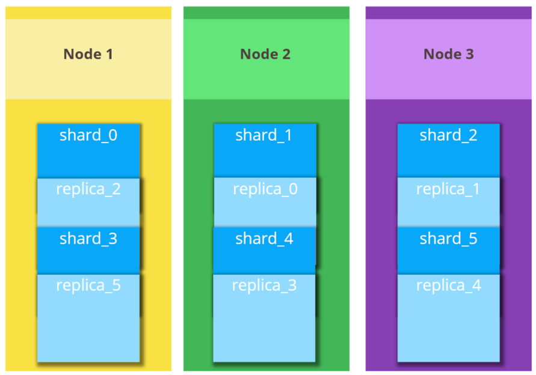

### Elasticsearch
#### Date : 2023-09-21  
#### Doc : https://coding-start.tistory.com/176      
https://esbook.kimjmin.net/02-install/2.1   
 

###  Elasticsearch    
+ 분산 시스템 
+ 클러스터 최소 Node 수 : 3개

         

#### 시스템 구조
+ Elasticsearch Cluster     
   
  + Cluster
    + 3개 이상의 Node가 모여 있는 것 
    + 각 Node는 단일 Elasticsearch 인스턴스 말함
    + 
  + Replica
  + Shard
    + 인덱스(=문서모음) 하위 요소로 분할
    + Cluster 여러 Node에 분산
    + 샤드가 Node에 배열되는 방식을 자동 관리, 균형 유지

##### Index & Shards

##### Node
+ Master Node
  + 
+ Data Node 
  + 

##### 형태소 분석(Stemming)

##### 토크나이저(Tokenizer)
  + 퍼포먼스 궁금
#####  

##### 용어정리
+ term : 
+ bucket : 
+ metrics : 
+ query dsl : 

