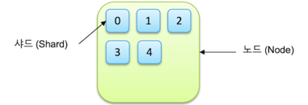
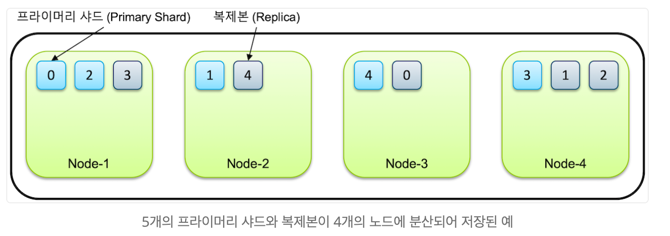

### Elasticsearch
#### Date : 2023-09-21  
#### Doc : 
+ https://coding-start.tistory.com/176         
+ https://esbook.kimjmin.net/02-install/2.1   
 

#### 요구 지식 
+ Java, 웹 기술, JSON
</br>

###  Elasticsearch    
+ 분산 시스템 
+ 클러스터 최소 Node 수 : 3개
+ NoSQL 분산 데이터베이스(MongoDB와 유사, 데이터 문서 형식으로 저장)
+ 로그를 저장하도록 설계된 실시간, 분산 및 분석 엔진입니다. 확장성이 뛰어난 문서 저장 엔진
+ Apache Lucene 검색 엔진을 기반
+ 구조화/비구조화 검색 가능 
</br>

#### Elasticsearch API
+ 문서 API
  + 단일문서 API
  + 다중문서 API
+ 검색 API
  + 모든 유형 검색하는데 사용 (검색 쿼리 실행하고 일치하는 검색 결과 가져오는데 사용)
  + GET 요청 : 문자열 매개변수 있는 쿼리 사용
  + 메시지 본문에 있는 쿼리 포함하는 게시물 요청 사용
  + 유형
    + 다중인덱스
    + 다중 유형
    + URL 검색 
+ 집합 
  + Bucketing
  + 미터법
  + 행렬
  + 관로
  
+ 인덱스 API
  + 생성, 가져오기 ,삭제, 열기/닫기, 별칭, 종료, 분석, 템플릿, 설정, 통계, 플러시, 새로고침
+ 클러스터 API
  + 건강, 상태, 통계, 보류중 클러스터 작업, 노드 통계, 노드 hot_thread
</br> 


#### 시스템 구조
+ Elasticsearch Cluster     
   
  + Cluster
    + 3개 이상의 Node가 모여 있는 것 
    + 각 Node는 단일 Elasticsearch 인스턴스 말함
    + 중간 규모 최적화
      + Data Node
      + Master Node
      + Codinator Node : 데이터 노드 부담 감소하여 성능 향상, 실행쿼리/로드밸런싱 실행쿼리 조정
      + 수집 노드 : Logstash 처럼 사용
      + 기계 학습 노드
    + 대규모 최적화(중대형 노드 40개 이상 경우)
      + 
  + Replica
    + 일반적으로 샤드 1개, 복재본 1개 자동 생성 
    + 모든 프로덕션 클러스터에 백업용, 하나의 복제본 갖추는 것이 좋음
    + 검색 성능에도 도움, 높은 처리량과 추가 용량 제공 
    + 추후 수정 가능 
  + Shard
    + 인덱스(=문서모음) 하위 요소로 분할
    + Cluster 여러 Node에 분산
    + 샤드가 Node에 배열되는 방식을 자동 관리, 균형 유지
    + 나중에 수정 불가(수정시, ReIndexing 필요)
    + CPU 리소스 차지
    + 검색 요청시 모든 샤드와 상호작용 발생
</br>
    

##### [Index & Shards](https://esbook.kimjmin.net/03-cluster/3.2-index-and-shards)
</br>       
- Index 
  + Document를 모아둔 집합
  + shard 단위 분리, 각 노드에 분산되어 저장
+ Shard
  + 단일 검색 인스턴스  
  + Primary Shard : 처음 생성된 샤드
  + Replica : 복제본 
  + 개수 설정 
    + 처음 생성할 때 지정, primary shard 변경 불가(재색인 해야함)    
      ```
        {
          "settings": {
            "number_of_shards": 5,
            "number_of_replicas": 1
          }
        }
      ```
    + replica 노드는 변경 가능 
      ```
        {
          "number_of_replicas": 0
        }
      ```    
+ 단 노드가 1개만 있는 경우 primary shard만 존재, 복제본 생성 안됨, 데이터 가용성과 무결성을 위해 최소 3개의 노드로 구성 할 것을 권장
+ primary shard 유실 되었을때, 남아있는 복제본(replica)가 primary shard로 승격후 다른 노드에 새로 복제본 생성    
   
</br>
 

##### [Master Node & Data Node](https://esbook.kimjmin.net/03-cluster/3.3-master-and-data-nodes)
+ Master Node
  + 클러스터 상태, 정보 관리 역할
  + 클러스터마다 하나의 마스터 노드 존재, 없을 경우 클러스터 작동 중지
  + 모든 노드가 master eligible node(마스터 후보 노드)
    + master node 죽거나, 다운되면 후보 node 중 마스터 node 역할 대신 수행 
      + master node 후보들 처음부터 마스터 노드 정보 공유하고 있기 때문에 즉시 역할 수행 가능
    + 모든 노드들 후보일 경우, 정보 계속 공유하는 것이 부담 -> 별도 후보 노드들만 따로 설정가능, 클러스터 향상에 도움됨
+ Data Node 
  + 실제 색인된 데이터 저장하고 있는 노드
</br>

##### 형태소 분석(Stemming)

##### 토크나이저(Tokenizer)
  + 퍼포먼스 궁금
#####  

##### 용어정리
+ Document : 단일 데이터 단위
+ Index : Document를 모아둔 집합
+ indices : 데이터 저장 단위 
+ 색인 : 데이터를 Elasticsearch에 저장하는 행위
+ term : 
+ bucket : 
+ metrics : 
+ query dsl : 

