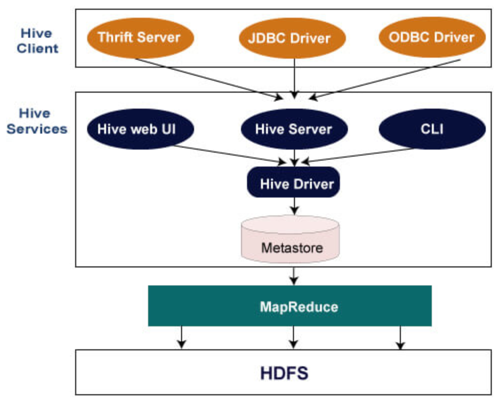

## Apache Hive
##### Date : 2023-08-01  

#### Hive  
- 동작방식  
               
    

#### Hive Architecture   
+ Hive는 HDFS 파일 형식을 소유하지 않는다.     
  + I/O 방식   
    + 사용자는 다른 도구를 사용하여 Hive 테이블에서 HDFS 파일을 직접 read
    + 다른 도구를 사용하여 "CREATE EXTERNAL TABLE"을 통해 Hive에 load
    + "LOAD DATA INPATH"를 통해 hivewarehouse 에 load   
+ HQL(Hive-SQL) : Java에 통합하는 데 필요한 SQL 추상화를 제공  
+ hivewearhouse : 실제 메타데이터(테이블 데이터)가 저장된 위치, Hive를 사용하기 전 HDFS에서 디렉터리 생성 필요    
+ Metastore   
  + Hive가 구동될때 필요한 테이블의 스키만 구조나 다양한 설정값이 저장      
  + 기본적으로 Hive는 포함된 Apache Derby 데이터베이스에 메타데이터를 저장(MySQL 과 같은 다른 클라이언트/서버 데이터베이스를 선택적으로 사용)           
  + Meta Store에 장애가 발생할 경우 Hive는 정상적으로 구동되지 않음, MySQL, Oracle, PostgreSQL 등에 저장, 3가지 실행모드로 동작     
    + 임베디드(Embedded) : 더비DB를 이용한 모드이며 한번에 한명의 유저만 접근이 가능(derby: metastore 저장하는 db, default)         
       
    + 로컬(Local): 별도의 데이터베이스를 가지고 있지만 하이브 드라이버와 같은 JVM에서 동작        
          
    + 리모트(Remote) : 별도의 데이터베이스를 가지고, 별도의 JVM에서 단독으로 동작하는 모드, 리모트로 동작하는 메타스토어를 HCat서버 있음       
          

##### HQL vs SQL 
- SQL(Structured Query Language) : RDBMS라고도 하는 관계형 데이터베이스 관리 시스템에 저장된 데이터를 관리       
- Hive 쿼리 언어(HiveQL) : HiveQL은 메타 저장소에서 구조화된 데이터를 분석하고 처리하기 위한 Hive용 쿼리 언어, equal join 만 가능        
, TEXT FILE, SEQUENCE FILE, ORC 및 RC FILE(Record Columnar File)의 네 가지 파일 형식을 지원      

    

##### Tunning HQL & SQL   
+ HQL      
  + 조건절 내의 UDF 제거    
  + DISTINCT COUNT 연산 피하기    
   COUNT(DISTINCT column) 함수를 이용하면 1개 리듀서에서 정보를 처리, GROUP BY 함수를 이용한 방법 지향     
  + JOIN 사용시 고려할 점    
   가장 큰 데이터의 테이블을 마지막에 놓거나 /*+STREAMTABLE(a)*/ 옵션을 이용     
   아웃 조인시 조인 수행후 WHERE 조건을 처리하기 때문에 중첩 SELECT 문을 이용해 먼저 데이터를 필터링 후 조인을 진행하도록 처리    
  + SELECT 사용 시 고려사항     
   *를 이용해 모든 데이터를 가져오지 않고, 필요한 칼럼 데이터만 선택    
  + Vectorized Query Execution(벡터화) :  일반적인 쿼리 작업의 CPU 사용량을 크게 줄이는 기능, 한 번에 1024행 블록을 처리      
   설정방법 : set hive.vectorized.execution.enabled = true;_  
   사용가능 타입 : tinyint, smallint, int, bigint, boolean, float, double, decimal, date, timestamp, string    
  + Hive 버킷팅: 대형 데이터 집합을 클러스터 또는 세그먼트하여 쿼리 성능을 최적화    
  + 조인 최적화  
  + 리듀서 증가 

+ SQL
  + 불필요한 인덱스 줄이기
  인덱스는 DDL문의 성능에 안 좋은 영향을 주고, Nested Loops Join을 이용하게 될 수 있기 때문에 적절한 수의 인덱스를 선언
  + WHERE 조건에서 함수 피하기
  + OR 조건 피하기
    

##### Solved Problem
+ 문제 :데이터 건수는 8만건정돈데 vertex error 가 발생 한다.  
  + 특징 : 총 column 개수는 20개, row는 8만, 특정 column value 전부 null 값   
  + Null은 카디널리티가 매우 높고 맵 측 집계가 제대로 작동하지 않는 경우 맵 축소 경계에서 폭발이 발생할 수 있음  
   Thrift는 맵에서 null을 지원하지 않으므로 객체 관계형 매핑(ORM)에서 검색된 맵에 있는 null은 가지치기하거나 빈 문자열로 변환 필요
  + 환경 : tez, hive   
  + 해결방법 
    + "set hive.vectorized.execution.enabled=true;" 으로 백터화 disable 처리      
    + 전부 null value 로만 된 컬럼 찾아 case when으로 공백 처리   
    

  + 문제 : hive external table에는 partitionby 존재, hivewarehouse에는 파티션단위 파일이 아닐경우 데이터가 dbeaver에서 보이지 않는다.
  + 환경 : hdfs, hive   
  + 해결방법 
    1. DDL에 partitionby를 제외
    2. hivewarehouse에 파티션단위(디렉토리)단위 적재

+ 문제 : select count(*) from temp_table 시, 데이터는 있는데 카운팅이 되지 않은 경우   
  + 특징 : 결과가 0건으로 나옴 
  + 환경 : hdfs, hive   
  + 해결방법
    + "Analyze table temp_table;", 메타데이터가 갱신되지 않아 통계정보를 못 읽는 현상으로 Analyze 명령 통해 수동으로 통계 정보 업데이트 필요  

##### Managed table & External table
+ Managed table
  + hive.metastore.warehouse.dir 경로에 존재, 해당 디렉터리 하위에 테이블의 데이터가 저장
  + 해당 경로에 테이블이 만들어지고 테이블을 삭제하는 경우 hdfs 경로에 있는 데이터 역시 함께 삭제
+ External table
  + hive.metastore.warehouse.dir 경로에 생성되지 않음   
  + 테이블 생성시 Location을 지정   
  + hive 테이블 제거해도 실제 hdfs상에 있는 데이터는 지워지지 않고 그대로 유지

##### Manage Metaster 

##### 용어정리
+ Serde  
  + Serializer(직렬화) 및 Deserializer(역직렬화) 약자
  + 파일 읽을 때 FileFormat 이용
  + Serde 과정
    + Deserializer로 원천 데이터를 테이블 포맷에 맞는 로우로 변환(HDFS files --> InputFileFormat --> [key, value] --> Deserializer --> Row object)    
    + Serializer로 Key, Value 형태로 변환후 FileFormat 이용하여 저장 위치에 씀(Row object --> Serializer --> [key, value] --> OutputFileFormat --> HDFS files)   
  + serde 종류(7가지) :Avro, ORC, RegEx, Thrift, Parquet, CSV, JsonSerDe  
  + 이 외 기본 LazySimpleSerDe 또는 Custom serde도 구현 가능
  
+ Serializaion(직렬화) : 객체를 저장, 전송할 수 있는 특정 포맷 상태로 바꾸는 과정    
+ Deserialization(역직렬화) : 특정 포맷 상태의 데이터를 다시 객체로 변환하는 것     
+ Hive Client 
  + Thrift server : Hive server, client 요청 받아 Hive Driver에 제공하는 역할 
  + JDBC Driver : Hive 와 Java 연결 역할 
  + ODBC Driver : Hive 와 ODBC 프로토콜 지원하는 역할  
        
+ Ranger : 하둡 플랫폼 전반에서 포괄적인 데이터 보안을 지원, 모니터링 및 관리하는 프레임워크     
+ Log4j : 자바 기반 로깅 유틸리티, 로깅 활성화하면 문제의 위치를 정확히 파악할 수 있음, 5단계의 로그 레벨 제공 
  + DEBUG < INFO < WARN < ERROR <  FATAL
  + DEBUG: 애플리케이션의 내부 실행 상황 추척할 수 있는 상세정보
  + INFO: 애플리케이션의 주요 실행 정보 
  + WARN: 잠재적 위험 상태. 경고.
  + ERROR: 오류 발생했지만, 애플리케이션 실행은 가능한 상태 
  + FETAL: 애플리케이션을 중지해야할 심각 오류 
  + TRACE: debug보다 상세한 정보를 찍고 싶을때.
+ Bucketing : 지정된 칼럼의 값을 해쉬 처리하고 지정한 수의 파일로 나누어 저장하는 방법, Join을 하거나 샘플링 작업을 할 경우 성능 향상
  + Partition vs Bucketing
    + Partition: 데이터를 디렉토리로 나누어 저장
    + Bucketing: 데이터를 파일별로 나누어 저장 
+ Skew : 데이터 편향 현상
  + Skew vs Partition 
    + 파티션: 주로 데이터를 크게 구분하는 용도로 사용, 보통 일자별로 구분할 때 많이 사용    
    + 스큐: 칼럼의 데이터를 구분할 때 사용, 하나의 칼럼에 특정 데이터가 몰려서 생성될 때 사용, 특정컬럼 이외 컬럼 묶어 관리 할 수 있어 Namenode 효율적 사용 가능   
+ HiveContext : Hive 데이터로 작업할 수 있는 Spark SQL 모듈(Spark과 연결시 사용)