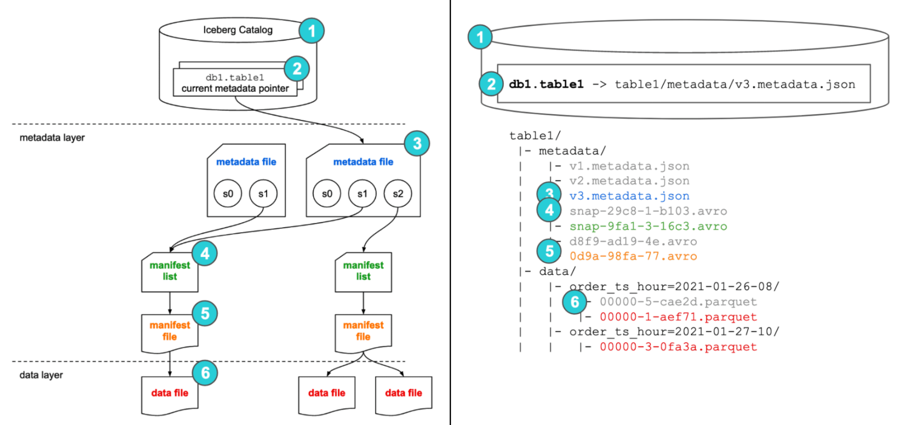

## Iceberg
##### Date : 2025-10-04   


#### Iceberg    
- Transaction Data Lake 
- ACID 보장
  - 원자성
  - 일관성
  - 독립성
  - 영속성 
- Distribute workload 
- Using with spark, hive, flink 
- Sparate Data and MetaData, Flexsible data partitioning, schema change, transction 
- 

    
</br></br>  


#### Iceberg Architecture      


1. 쿼리로 Iceberg catalog 
2. db1.table1 접근, 최근 metadata 파일 위치 찾기
3. metadata data 파일 오픈, snapshotsㅇ로 manifest list 찾기   
IceBerg table 전체 정보 관리하는 JSON 파일    
스냅샷리스트, 현재 활성화 스냅샷 ID, 스키마 버전, 파티션 스펙 등 정보 있음    
새 스냅샷 추가될때마다 JOSN 파일 새 버전 기록 되는 방식      
4. manifest list 접근하여 manifest 파일 위치 검색   
스냅샷에 속한 여러 매니페스트 파일 리스트     
매니페스트마다 파티션 범위, 참조파일(.parquet)참조 정보 담고 있음    
5. manifest file 오픈, 실제 데이터 위치 찾기      
데이터 파일의 파티션 정보, 파일크기, 레코드 수, min/max 통계 등 정보 포함 
데이터 프루닝(prunning) 작업으로 불필요한 파일 스캔 줄일 수 있는 이점     
6. 실제 데이터 파일 읽기, return select * from table_name      

* manifest : 스냅샷 저장 용도, avro type 

#### Iceberg vs DeltaLake
- ACID Transaction 제공
- 이전/변동 상태에 대한 히스토리 추적 가능
- Iceberg
  - 파티션(Hidden PartitioninG) 테이블에 효과적(Data organization)
  - 스냅샷(snapshot) 사용으로 스키마 변동 지원 제공, 계층적 메타데이터 구조(hierarchial) : manifest files, manifest lists, and metadata files
  - spark, presto, flink 기반 분석
  - 깊은 데이터 구조 지원, Fully Schema Evolution
  - Merge on Read : 데이터 읽고 쿼리 시점에 변경사항 적용
  - 주 사용 파일포멧 : Parquet, ORC, Avro 
  - 분할 및 압축과 같은 기능을 통해 고급 데이터 구성(쿼리 성능 최적화 위해 주기적 작은 파일 결합)
- DeltaLake
  - Databricks 에서 주로 사용
  - Streaming 서비스에 더 많은 수요 (+ kafka + sparkstreaming + deltalake)
  - Transcation Log(Delta Log) 기반 관리
  - Upsert/Delete 많은 경우, partial Support 
  - Merge on Write : 데이터 병합 후 쓰기, 읽기 속도 높음 
  - 스키마 준수 지향 
  - 주 사용 파일포멧 : parquet
  - 쓰기 작업 할때 자동 압축 및 인덱싱 기능, 작은 파일 관리에 적합(오버헤드 감소시켜 성능향상)
  - 

- Iceberg는 partition 기능 있음, 스트리밍 필요없음, 

delta는 단타성(?) 또는 스트리밍 관련한는데 많이 사용하는듯
Iceberg는 ACID 필요로 하는 테이블 관리(DL/DW/DM)등에 필요로 사용하는 듯 
 


#### Q&A
**Q. IceBerg 스키마 관리는 어떻게 하시나요? 예> 테이블명, 컬럼명, 컬럼타입 변경되었을때 처리방식?**
A. ACID


**Q. iceberg 와 deltalake 중 어떤 도구가 스트리밍 서비스에 적합한가요?**    
A. deltalake + KafKa +SparkStreaming 조합으로 많이 사용합니다.          
둘다 CRUD를 제공해주는 공통점 갖고 있음          
deltalake 는 소규모성 데이터 작업(실시간 스트리밍)에 많이 사용하는 편인거 같고          
iceberg는 대용량 데이터 핸들링시 많이 사용하는 툴                    

**Q. 파티션(partition) VS 버킷(bucket)의 차이는? 어떠한 경우에 사용하시나요?**     
A. 
``` 
  | 구분    | 파티션                     | 버킷                            |
  | -----  | -----------------------  | -----------------------------  |
  | 기준    | 컬럼 값                    | 컬럼 해시값                        |
  | 저장 단위| 디렉토리(low cardinality)   | 파일(high cardinality)     |
  | 장점    | 쿼리 필터링 최적화             | join/shuffle 최적화, 균등 분배          |
  | 단점    | 너무 많은 파티션 → small files | 버킷 수 고정, 관리 복잡                  |
  | 사용 예  | 날짜별 로그, 지역별 데이터       | 특정 컬럼 기준 join/aggregation 최적화 |
  | 사용 방법  | PARTITIONED BY             | CLUSTERED BY |
```
  - 열의 카디널리티 높을 경우 파티션사용하면 폴더/디렉토리가 많이 생성됨 -> NameNode에 오버헤드 초래         
(NameNode는 파일 시스템의 모든 메타데이터를 메모리에 보관하기 때문)
  - 카티널리티(cardinality)란? 
데이터 중복값          
중복값 많다 -> 카디널리티 낮다 Ex) 이름, 과목명           
중복값 적다 -> 카디널리티 높다 Ex) 주민등록번호, 학생ID, 과목ID               

**Q. 메타데이터 관리 방식은?**       
A. 데이터 변경 히스토리가 누적될수록 스냅샷 누적으로 메타데이터 증가로 인한 성능 저하 있을 수 있음               
정기적인 메타데이터 최적화 작업 필요              


**Q. column 변동 사항에 대해 자동으로 알 수 있는 방법은 없나요?   
예시 상황, DW daily batch "col1" 이름으로 적재되고 있는 상황. 
다음날 "col1"에서 "col2"로 데이터 들어옴. 
col2 의 기존 컬럼명이 col1 이란 것을 알 수 있을까요?**        
A. 기존 deltalake에서 제공해주는 auto catch 의 개념은 rename에 가까운 의미.   
col1 이 col2로 변경되었다는 부분 자동으로 알 수 없음       
sol1 > autoMerge 기능 활성화 방법 : 새로운 컬럼이 등장할 경우 추가 되는 방식              
```
  df.write.option("mergeSchema", "true").mode("append").format("delta").save("tmp/fun_people") 
```        
```  
  result set >> 
  +----------+----+-------+
  |first_name| age|country|
  +----------+----+-------+
  |   jordana|  26| brasil|
  |     frank|  68|    usa|
  |   sabrina|null|   null| # new
  |   dahiana|null|   null| # new
  +----------+----+-------+
```  
sol2 > autoMerge를 사용       
```
  spark.conf.set("spark.databricks.delta.schema.autoMerge.enabled", "true")
```  

**Q. 스키마 진화(schema evolution) 운영은 어떻게 하면 좋을까요?            
mergeSchema 사용시 컬럼명 증가, 데이터파이프라인 운영, 데이터품질 운영, 품질 유지에도 연관있을 거 같은데요.**        
A. 
sol1 > 테이블 단계별 분리 하여 운영 방식      
예시로, 원천(Raw) -> table1(DL) -> table2(DW) 구조로 나눠     
원천은 스키마 없는 상태      
table1은 mergeSchema=true처리, rename 또는 alter 등의 처리 작업 등을 수행하는 역할    
table2은 완전체, 안정성 추구 

sol2 > 컬럼 체크 로직 도입(동일한 위치에 컬럼명이 다르다면 변경된 컬럼, 맨 뒤 남는 컬럼은 신규로 추가 된 컬럼 가정)      
step1) 기존 테이블 메타데이터와 신규 데이터의 메타데이터 컬럼명 추출 (List 타입으로, 순서 보장위해)      
step2) 각 추출한 컬럼명 비교       
조건은, 신규 추가 컬럼은 맨 뒤 삽입 할 것       

sol3 > 스키마 변경/새로운 컬럼 생성 관한 알림           
기존 스키마(또는 메타데이터)와 새로 유입된 데이터의 스키마(또는 메타데이터)를 비교하여 차이점 체크 구현 후 알림 발송(Teams or Slack or E-mail)


**Q. Iceberg는 rename 자동변환 후 적용 기능은 없나요?**     
A. rename 감지를 자동으로 하지 않음.    
rename이 빈도가 높다면 Iceberg 사용 추천. 이유는 rename lenegy 관리가 더 쉽기 때문. 
Iceberg는 field "id" 기준으로 추적하고 메타데이터 관리함 


**Q. snapshot 관리는 어떻게 하셨나요?**     
A. 

**Q. compaction 관리는 어떻게 하셨나요?**      
A. 