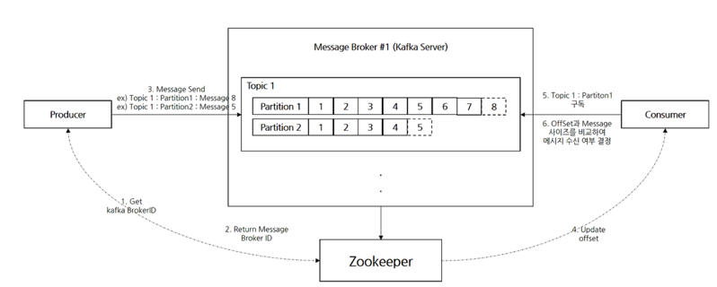

## Kafka
##### Date : 2024-08-21   

#### Kafka    
- 메시지 브로커 
- 메시지 Queue(큐) 지원
  - 읽혀진 메시지 queue에서 제거
- PUB/SUB 모델
  - 프로듀서가 메세지를 컨슈머에게 직접 전달하지 않고 중간의 메시징 시스템에 전달
  - 메시징 시스템만 동작한다면 프로듀서에게 전달된 메세지 유실되지 않음
  - 확장성이 용이
  - 단점
    - 직접 통신을 하지 않아 메시지가 정확하게 전달 여부 확인 로직 필요
    - 중간에 메시징 시스템이 이있기 때문에 메시지 전달 속도가 빠르지 않음
    - 

    
    

#### Kafka Architecture 
+ Kafka(Message Broker)
  + 메시지를 TCP로 전송하기 위한 브로커를 제공하는 메시지 브로커
  + Kafka 클러스터는 일반적으로 로드밸런싱과 가용성을 유지하기 위해 3 Node Message Broker로 구성 (ES 와 비슷한듯..) 
  + Producer 및 Consumer에게 정보를 전달
  + TCP 전송방식   
+ Topic
  + Kafka에서 메시지를 주고 받기 위해 사용되는 Key
  + 대용량 처리, 여러개의 Partition 지정, 병렬처리 
  + Partition의 메시지의 정보를 offset(현재 위치)과 비교하여 메시지 수진 여부를 결정
  + Message Max size : 1MB 
  + Topic / Partition / Message 단위
+ Zookeeper
  + 메시지 큐의 데이터 관리
  + kafka message broker 랑 동일한 개수로 구성      예시) Node Message Broker 3대일때, Node Zookeeper도 3대 
+ Producer
  + 데이터를 브로커에 Push 역할
  + 
     

#### Kafka 대용량 데이터 전송 방법 & 환경설절
+ 

##### 용어정리
+ 큐(QUEUE) : FIFO(선입선출, First In First Out) 구조, 
+ 스택(STACK) : LIFO(후입선출, Last In First Out) 구조, 가장 마지막에 삽입된 자료 먼저 삭제됨
+ 스택오버플로우 : 스택이 넘치는 경우(유명한 사이트의 이름 유래 된거 맞음)
+ 스택언더플로우 : 빈 스택에서 원소 추출하려고 할때
+ RabbitMQ : 
+ 비트(bit) < 바이트(byte) < 킬로바이트(KB) < 메가바이트(MB) < 기가바이트(GB) < 테라바이트(TB)

