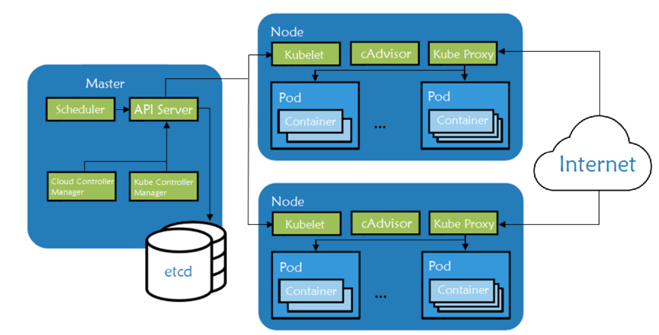
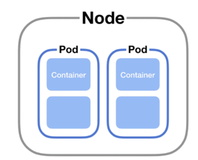
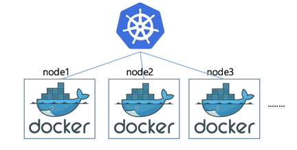

## Kubernetes
### Kubeflow and Aiflow 
##### Date : 2024-03-13

#### Kubernetes  
- 어플리케이션을 클러스터내에 안정적, 효율적으로 배포하는 SW
- 여러대의 클러스터를 타겟
- 클러스터 내에서 Pod(어플리케이션) 분산 배치 
- 한개의 pod는 한개의 node 에서 실행
- 자동으로 pod 운영/배포
- 쿠버네티스 실행시 실행할 pod 정보 명령하면 자동 배포 방식
  - pod 일부 버그(오류)발생 시 일부 종료 또는 재실행 가능
- 목적
  - Pod들을 안정적, 효율적으로 클러스터링 동작하는 것 
  - Pod 단위로 어플리케이션 쪼개서 개발/운영
- Pod
  - 쿠버네티스가 생성하고 관리하는 작은 컴퓨팅 단위
  - 한개 이상의 리눅스 컨테이너로 구성 
  - 한개의 프로세스, 컨테이너 개념이라고도 함
  - 
-     
    3개의 클러스터 안에서 pod들 동작 과정  
-  
   
  - pod와 container 관계 
  - pod 생명주기 != pod 내 컨테이너 생명주기
    - 예시> 
        - 컨테이너 문제 : 컨테이너 재실행 
        - pod 문제 : pod 포함된 컨테이너 모두 재실행
    

#### Docker != Kubernetes
+ Docker
  + 이미지를 컨테이너(생성/실행) 기술 스택(플랫폼)
  + 어플리케이션과 환경을 독립적으로 패키징하고 실행 가능한 도구 
  + 한개의 컨테이너 관리하는데 최적화
+ Kubernetes
  + 컨테이너 오케스트레이션 툴
  + 도커 컨테이너 관리하고 배포할 수 있는 플랫폼 
  + 여러개 컨테이너 서비스 단위로 관리하는데 최적화
+ 

+ Kubeflow
  + 
 

