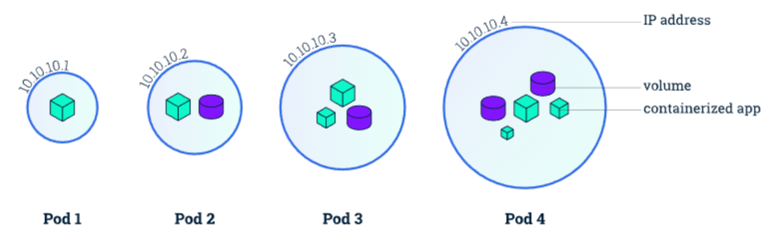

## Kubernetes
### Data pipleline - Kubeflow, Aiflow 
##### Date : 2024-03-13

#### Kubernetes  
- 어플리케이션을 클러스터내에 안정적, 효율적으로 배포하는 SW
- 여러대의 클러스터를 타겟
- 클러스터 내에서 Pod(어플리케이션) 분산 배치 
- 한개의 pod는 한개의 node 에서 실행
- 자동으로 pod 운영/배포
- 쿠버네티스 실행시 실행할 pod 정보 명령하면 자동 배포 방식
  - pod 일부 버그(오류)발생 시 일부 종료 또는 재실행 가능
- 목적
  - Pod들을 안정적, 효율적으로 클러스터링 동작하는 것 
  - Pod 단위로 어플리케이션 쪼개서 개발/운영
- Pod
  - 쿠버네티스가 생성하고 관리하는 작은 컴퓨팅 단위
  - 한개 이상의 리눅스 컨테이너로 구성 
  - 한개의 프로세스, 컨테이너 개념이라고도 함
  - 
-     
    3개의 클러스터 안에서 pod들 동작 과정  
-  
   
  - pod와 container 관계 
  - pod 생명주기 != pod 내 컨테이너 생명주기
    - 예시> 
        - 컨테이너 문제 : 컨테이너 재실행 
        - pod 문제 : pod 포함된 컨테이너 모두 재실행
    

#### Docker, Kubernetes
+ Docker
  + 이미지를 컨테이너(생성/실행) 기술 스택(플랫폼)
  + 어플리케이션과 환경을 독립적으로 패키징하고 실행 가능한 도구 
  + 한개의 컨테이너 관리하는데 최적화
+ Kubernetes
  + 컨테이너 오케스트레이션 툴
  + 도커 컨테이너 관리하고 배포할 수 있는 플랫폼 
  + 여러개 컨테이너 서비스 단위로 관리하는데 최적화
+ 

#### Airlow VS Kubeflow
+ Airflow
  + 범용적 Task 오케스트레이션 
  + Dag 기반
  + 데이터 파이프라인, ML 모델링, 인프라 관리 등 다양하게 사용 가능
  + 다양한 환경 작업 가능
  + 단순 파이프라인 조정 플랫폼
  
+ Kubeflow(Kube + Flow)
  + 기계학습 워크플로우 (Machine Learning Workflow)
  + pipeline 기반
  + 일련의 ML 자동화 작업에 특화된 쿠버네티스 전용 툴
  + 쿠버네티스 환경에서만 동작
  + ML 기반 다양한 학습 기능 제공

+ Tool 도입시 고려사항
  + 프로젝트 전반에 걸친 워크플로우가 ML 중심인가? 아닌가?   
    ┖ Airflow 선호 기업 많음(특화된 부분들을 직접 구현해야하지만),    
     쿠버네티스가 있어야 동작 가능하고 큐브플로우는 ML 중심 역할 제공  
  

#### Airlow + Kubernetes 사용 사례 및 예시
+ 늘어나는 DAG   
┖ DAG 증가로 다른 Task 실행시간 지연 및 동작 이상 없도록 리소스 확보 할당 
단일 컴퓨팅 아닌 kubernetes 도입 : Node Auto Scaling 통해 리소스 유연하게 확보 가능
노드풀 직접 관리 가능 : CPU,GPU 사용량 높은 파이프라인 실행 적합
Kubernetes Excutor 사용
+ 규칙없는 DAG 와 코드
┖ 일관성 있는 코드와 표준화 작업 필요
+ 복잡한 의존성
┖  Workflow 와 라이브러리 의존성 낮추어야 함    
KubernetesPodOperator를 사용 : 실행할 프로그램 컨테이너 이미지로 말아두고 KubernetesPodOperator로 실행
+ 운영과 테스트의 혼돈

+ kubernetes 단점     
┖ 운영 복잡도, 난이도 증가 할수도..

