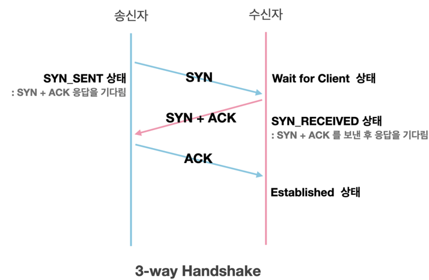
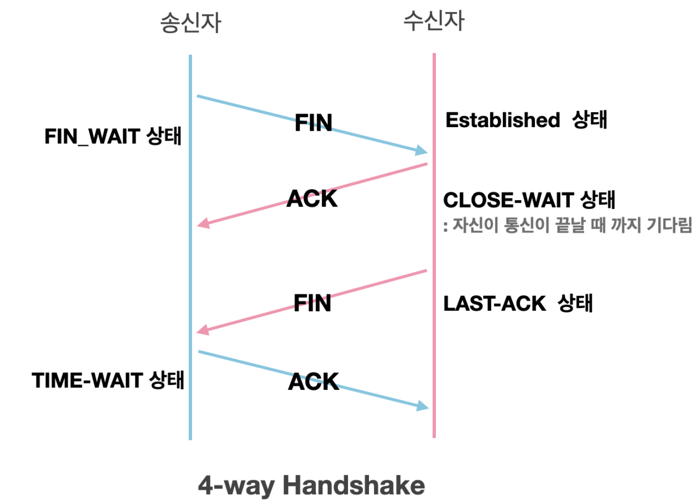

### Couputer Network 
#### Date : 2023-08-01 ~    

+ **http vs https**       
  + **Http**   
    + hyper text Protocol, client 와 server 간에 통신규약   
    + 80 port (default)   
    + 인터넷 통한 통신 지원   
    + 웹서버에서 http 응답으로 요청   
    + OSI 통신 모델   
    + 비암호화 (읽고 쓸때 3자가 가로체기 가능 ->https 탄생에 한몫)   
    + TCP/ IP를 이용하는 응용 프로토콜
    + 비연결성
  + **Https**   
    + Hyper text transfer protocol secure  
    + 443 port (default)  
    + 웹 사이트 권위, 신뢰성, 검색엔진 순위 개선  
    + 인증서 사용(SSL/TLS)    
    + (http보다)신뢰성 높음  
    + 모든 데이터 암호화 형태로 전송   
    + 대칭키와 비대칭키 암호화 모두 사용   
    + 3 hand shaking    

  + **http 에러코드**  
    + 1xx : (정보) 요청을 받았으며 프로세스를 계속 실행
      + 100 continue  
    + 2xx : (성공) 요청을 성공적으로 받았으며 인식했고 수용
      + 200 OK,정상
      + 201 creat, post 성공
    + 3xx : (리다이렉션) 요청 완료를 위해 추가 작업 조치
    + 4xx : (클라이언트 오류) 요청의 문법이 잘못되었거나 요청을 처리
      + 400 bad request
      + 403  Forbidden 접근 거부 문서 요청
      + 404 not found
      + 405 method not allowed ,리소스 허용 안함
      + 406 not acceptable 허용 할 수 없음
    + 5xx : (서버 오류) 서버가 명백히 유효한 요청에 대해 충족을 실패
      + 500 내부 서버 오류
      + 501 not implemented, 서버가 수행할 수 없는 행동 요구 함
      + 502 bad gateway 서버 과부화
      + 503 service unavailable
      + 505 Http version not found

  + **요청 메소드** 
    + Create : Post
    + Read : Get
    + Update : Put
    + Delete : Delete
  
+ **TCP/UDP**
  + 전송계층 프로토콜
  + TCP : Transmission Control Protocol
    + 연결 지향 방식, 패킷교환방식
    + 3-way handshaking과정을 통해 연결을 설정하고 4-way handshaking을 통해 해제
      + 3-way handshaking : 데이터 전송 전에 송신자와 수신자 사이에 세션을 수립하는 과정    
            
        + setp1. 클라이언트는 서버에 연결요청(SYN) 패킷 전송 후 대기(SYN_SENT 상태) 서버는 Wait for Client 상태
        + setp2. 서버는 SYN 받고 SYN+ACK 응답 
        + setp3. 클라이언트는 서버에 ACK 응답 후 Establish(연결 완료)
      + 4-way handshaking : , 데이터를 주고 받은 뒤 연결을 해제 과정    
         
        + step1. 클라이언트는 서버에 연결 종료(FIN) 전송
        + step2. 서버는 ACK 전송 후  Close-wait (Time-out)
        + step3. 서버 연결 해제 준비 전송(FIN), Last-Ack 상태
        + step4. 서버에 ACK 응답 (Time-out) 
        + ** Time-out : 연결이 해제되어 유실되는 경우를 대비해 잉여 패킷을 기다리는 대기 시간 
    + 높은 신뢰성
    + UDP보다 속도가 느림
    + 전이중(Full-Duplex), 점대점(Point to Point) 방식
    + 서버와 클라이언트는 1:1
    + Streaming 서비스에 불리(손실된 경우 재전송 요청을 하므로)
    + SYN, ACK, SYN-ACK와 같은 핸드셰이크 사용
    + 사용 예시 : 이메일, 파일 전송, 웹 브라우징
    
  + UDP(User Datagram Protocol)
    + 비연결형 프로토콜, 데이터그램 방식
    + 정보를 주고 받을 때 정보를 보내거나 받는다는 신호절차를 거치지 않는다.
    + UDP Header CheckSum 필드를 통해 최소한의 오류만 검출
    + 신뢰성이 낮음
    + TCP보다 속도가 빠름
    + 연결 자체가 없어서(connect 함수 불필요) 서버 소켓과 클라이언트 소켓의 구분이 없음
    + 소켓 대신 IP를 기반으로 데이터를 전송
    + 흐름제어(flow control) 불가능
    + 서버와 클라이언트는 1대1, 1대N, N대M 등으로 연결 가능
    + 핸드셰이크가 없음
    + 사용예시 : 비디오 스트리밍, 실시간 서비스(streaming)에 자주 사용     
        
  

+ **Cookie&Session**
  +
  
+ **bandwith** 
  
+ **iso 7**
+ **통신 명령어** 
+ **SFTP**
+ **DNS와 같은 인터넷 프로토콜**

+ **ssh/scp** 
  + SSH(Secure Shell), 원격지 호스트 컴퓨터에 접속하기 위해 사용되는 인터넷 프로토콜, 22 port(default),  접속시도시 key 제출방식, 
  + 공개키 : 리모트머신(client)
  + 비공개키 : 로컬머신(server)
  + 키 생성 명령어 : ssh-keygen -t rsa
  + SCP(Secure Copy) : ssh 원격 접속 프로토콜을 기반, 원격지에 있는 파일과 
  + 디렉터리를  보내거나 가져올 때 사용하는 파일 전송 프로토콜, 22port 