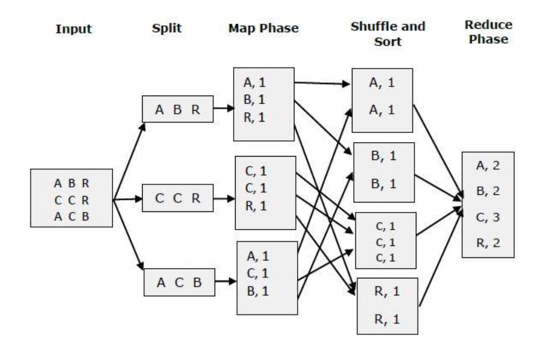

1. 하둡과 전통적인 RDBMS의 차이점은?
   + 데이터 타입   
     + 하둡은 정형, 반정형, 비정형 데이터   
     + RDBMS는 정형 데이터    
   + 스키마   
     + 하둡 - Schema on Read   
     + RDBMS - Schema on Write   
     + 데이터를 읽을 때 스키마를 적용하느냐, 데이터를 적재할 때 스키마를 적용하느냐    
     + https://goo.gl/images/dQiQCJ       
   + 좋은 사용법      
     + 하둡은 대용량 데이터 처리     
     + RDBMS는 OLTP 데이터 처리나 복잡한 ACID 트랜잭션에 적용      
   + 속도     
     + 하둡은 쓸 때 빠르고    
     + RDBMS는 읽을 때 빠름            
            

2. 빅데이터에서 4V는 무엇을 말하나요?
빅데이터에 대한 정의는 기본적으로 3V이고, 업체에 따라 추가적인 내용을 더해 5V까지 확장 됨
   + Velocity(속도)
     - 데이터가 쌓이는 속도도 빠르고, 사라지는 속도도 빠름
   + Volume : 양
     - 테라에서 엑사 바이트의 데이터
   + Variety : 다양성
     - 정형, 비정형의 데이터
     - 수치화가 힘든 데이터도 포함
   + Veracity : 진실성
     - 표본이 커서 정확성도 높아짐
   + Value : 가치
     - 유용한 정보를 제공해야 함     
  
     
4. 대용량 데이터 분석에 하둡이 유리한 이유
   - 애플리케이션/트랜잭션 정보는 매우 크다. -> 대용량 파일을 저장할 수 있는 분산 파일 시스템을 제공한다.
   - I/O 집중적이면서 CPU를 많이 사용한다.  -> 멀티 노드로 부하를 분산시켜 처리한다.
   - 스케일 아웃에 유리하다. -> 장비를 추가하면 성능이 선형적으로 증가한다.
   - 데이터 베이스는 소프트웨어와 하드웨어가 비싸다. -> 하둡은 저렴한 장비로도 처리가 가능하다. 

5. 정형데이터와 비정형데이터의 차이점은?
   - 데이터 분류의 기준은 스키마의 유무이다.
       - DB 스키마, XML 스키마 등 데이터 타입, 크기 저장 방법등을 선언한 것
   - 정형데이터는 스키마가 존재하고, 데이터가 행,열로 구분가능한 데이터이다.
       - DBMS에 저장된 데이터나 스프레드 시트에 저장된 데이터가 가장 좋은 예이다.
   - 반정형데이터는 데이터 내부에 정형 데이터의 스키마에 해당하는 메타 데이터를 가지고 있으며 일반적으로 파일 형태로 저장되는 데이티
           - XML, HTML, 시스템 로그 등
   - 비정형 데이터는 정해진 형태가 없는 데이터 이다.
       - 동영상, 이미지, 텍스트 데이터 등

6. 하둡은 어떤 컨셉으로 동작하는가?
	- 하둡은 두개의 중요한 개념으로 동작한다. HDFS와 MR이다.
	- HDFS는 자바로 작성된 확장과 신뢰성이 높은 분산 파일 저장시스템이다.
	- 파일은 블록단위로 저장되고, 마스터-슬레이브 구조로 동작한다.  
	- MR은 자바로 작성된 하둡 클러스터를 위한 작업 프로그램이다. 
	- 맵과 리듀서로 구성된다. 맵이 데이터를 키, 밸류 쌍으로 구분하면 리듀서는 이를 가공하여 지표를 생성한다. 
	- 데이터가 있는 곳으로 프로세스를 가져간다. 

7. Hadoop 핵심 구성 요소?
	- Hadoop Common
		- 하둡의 다른 모듈을 지원하기 위한 공통 유틸리티
	- HDFS(Hadoop Distribute File System)
		- 하둡 기본 스토리지 시스템
        - 고가용성을 지원하는 분산파일 저장시스템
	- MapReduce
		- 대용량 데이터의 병렬처리를 위한 YARN 기반의 시스템
	- YARN
		- 잡 스케줄링과 클러스터 리소스 관리를 위한 시스템
	- 기타
		- Ambari : 웹 기반의 모니터링 시스템
		- Avro: 데이터 직렬화 도구
		- Cassandra:
		- Chukwa: 데이터 수집 도구
		- HBase : 대용량 데이터의 저장을 위한 도구
		- Hive: 데이터 저장, 정제, AdHoc 쿼리를 지원하는 도구
		- Mahout: 머신러닝 도구
		- Pig:
		- Spark:
		- Tez:
		- Zookeeper:
	- http://hadoop.apache.org/     
       
   
8. 하둡 스트리밍이란?
   - 하둡은 Java 를 이용한 맵리듀스 처리외에 다른 언어를 언어를 이용한 맵리듀스 처리를 위한 인터페이스를 제공
   - 이를 하둡 스트리밍 이라고 한다. 파이썬, 펄, 루비, 쉘 스크립트 등을 이용하여 처리가 가능
   - http://blrunner.com/23
  

9. 하둡 환경 구성을 위한 하드웨어 구성은?
   - 듀얼코어에 4~8G 정도의 일반적인 하드웨어로도 동작 가능
     

10. 하둡에서 사용되는 입력 포맷은?
    - Text Input Format: 하둡의 기본 입력 포맷
    - Key Value Input Format: 줄단위로 나누어진 텍스트 파일
    - Sequence File Input Format: 
  
    
11. 빅데이터?
    - 기존의 데이터베이스 시스템으로 처리할 수 없는 큰 용량의 데이터
    - 3V로 정의할 수 있음
  
    
12. OLAP vs OLTP
    + OLTP  
      + 온라인 트랜잭션 처리
      + 데이터 자체 처리 중심
      + 데이터 효율화, 무결성 중심 (실직적인 데이터 CRUD 작업 의미하는 용어)
      + 주 트랜잭션 : select, insert, update, delete
    + OLAP
      + 온라인 분석 처리 
      + 이미 저장된 데이터를 기반하여 분석
      + 사용자 요구와 목적에 맞게 분석하여 정보 제공하는 개념
      + 주 트랜잭션 : select 
    + OLTP가 선행 되어야함 -> 데이터 무결해야 분석해도 의미가 있으므로       
       

13. 분산처리 vs 병렬처리    
    + 분산 처리(Distribute)       
      + 장비(컴퓨터 등)을 네트워크로 상호 연결하여 전체적인 일의 부분 부분을 나누어 더 빨리 처리 할 수 있게 하는 시스템 방식
      + 하나의 일을 여러 컴퓨터가 붙어 동작하는, 개인 컴퓨터 여개를 한대처럼 쓰는 형태
      + 다수 컴퓨터 또는 네트워크를 Cluster(클러스터)라고 함, 
      + LAN을 통해 데이터 처리
      + 클라인트(Client) <-> 서버(Server) 구조
    + 병렬 처리(Parallel)
      + 2개 이상 CPU가 동작하는 방식
      + 프로세서를 늘려서 여러 일을 동시에 처리 => 다중 프로세서(Multi processors)
    + 이 둘은 단일에서 여럿으로, 일을 동시에 처리한다는 점이 유사하지만 전체적인 틀에서 보면 일을 처리하는 방식이 매우 다름       
     

14. ETL vs ELT
    + ETL[Extract(추출), Transform(변환), Load(로드)]
      + 데이터 스테이징 단계가 소스와 데이터 웨어 하우스 사이
      + 정교한 데이터 변환을 수행
    + ELT[Extract(추출), Load(로드), Transform(변환)]
      + 구조화/비구조화/반구조화된 데이터, 원시 데이터 형식 등 모든 데이터 형식
      + DataLake 밀접 , 구조화 되지 않은 데이터 수용 
      + 필요한 데이터만 변환
      + ETL보다 안정성이 부족한 ELT      
       
      
15. 모니터링 서비스 사용경험? > 데이터, 프로세스..등 문제가 생겼다고 하면 후처리를 어떻게 해보았나     
    + Kibana      
      + Mysql 에 있던 데이터 시각화, 집계 쿼리, 에러 상황 db 에 별도 저장 하여 kibana에 간단한 에러상황 노출 
    + 팀즈 webhook 알림, Mail 알림, Slack 알림 기능 직접 구현 하고 조직내에 전파 
 

16. Avro vs Parquet
    + Parquet
      + 열 기반 - 읽기 최적
        + 필요한 열만 선택적으로 읽어 올 수 있어 부하 적음
    + Avro
      + 행 기반 - 쓰기 최적
        + 한개의 열을 읽기 위해 행전체 읽기 수행해야 함

17. 사용해본 저장소 
    + ES
    + HDFS
    + S3
18. DDP 설명
19. 주로 사용하는 python lib
20. pyspark 에서 주로 사용하는 lib
21. spark / hive 차이 
    + Hive 
      + HQL 사용
      + Hadoop 필수     
      + 디스크 기반
      + 안정적인 일괄 처리 프레임워크
      + JDBC, ODBC, Thrift 드라이버 지원 
        + JDBC : 자바와 데이터베이스를 연결하기 위한 자바API, JAVA 에서만 가능 
        + ODBC :  표준 개방형 응용 프로그램 인터페이스 ,ORACLE, MySQL 등등)와 연동이 필요할 때 사용 
      + 배치 처리, 대규모 Datawarehouse
      + 메타스토어 관련 정보를 저장하고 테이블을 만들고 관리 목적
    + Spark
      + SQL 사용
      + Hadoop 필수 아님 
      + 메모리 기반
      + 행 수준 업데이트, 실시간 온라인 트랜잭션 처리 지원 
      + MR, SQL query , MLlibe, Grapth 처리 지원 
      + Java, R, Python 다양한 언어 지원 
      + 실시간 스트림 처리
 
22. 맵리듀스(MapReduce) 왜쓰나? 장/단점?
    + 여러 노드에 태스크를 분배 하는 방법
    + 단위작업을 처리하는 맵(Map) 작업과 맵 작업의 결과물을 모아서 집계하는 리듀스(Reduce) 단계   
    
    + Mapper    
      + Key/Value 형태로 데이터 읽음   
    + Reducer
        + Shuffle 과정에서 동일한 key 값 있으면 동일한 Reducer에 할당
        + Mapper에서 Shuffling 결과를 리스트(List) 형태로 받음         
          + ex) value값 철자 단위 분리하여 출력할 경우 ('foo', 'bar') -> [('foo', 'b'), ('foo', 'a'), ('foo', 'r')]
    + Key & Value 선호이유 
      + Key로 sorting, Grouping 작업 용이 => 빅데이터 구성하는 기본 데이터 구조로 채택 됨 (spark 도 동일)
 
23. Spark Session vs Spark Context
    + Spark Session > SQL Context > Spark Context
    + Spark Session
      + /2.x 부터 사용가능한 spark 진입점 
    + SQL Context
    + Spark Context
24. KAFKA 설명 
    + 분산 메시지 큐 솔루션, 메시지(데이터)의 송신자와 수신자의 중개를 하는 시스템
    + Pub-Sub 메시징 모델
    + Publisher가 Subscriber에 직접 메시지를 보내는 대신 항상 Broker를 사이
    + Publisher에서 보낸 메시지는 Broker의 Topic에 저장
    + Topic에 저장되어야 하는지를 Publisher로부터 지정
    + 각 Subscriber는 특정 Topic에서만 선택적으로 메시지를 받음
    + Broker : Publisher/Subscriber 는 브로커만 바라보고 통신하면 된다는 이점, 브로커 없다면 개별 통신 이뤄져야 함, 메시징 모델 변경 용이 
    + Producer : Publisher, 메시지 생성(송신)
    + Consumer : Subscriber, 메시지 수신(수신)
25. spark vs mapreduce 
    + spark
      + RAM 에서 데이터 처리 (메모리 기반)
      + 동일한 데이터 여러번 반복 하는 작업 유용 
      + Java, Scala, Python 과 함께 사용 가능 ,SQL 도 있음
    + MapReduce
      + 맵 또는 리듀스 작업 결과를 디스크에 write 
      + ETL 같은 원패스 작업에 유리 
      + JAVA로 작성, 프로그래밍 하기 어려움 (Hive SQL 호환성 제공)
26. 파티셔닝과 버켓팅 차이점
    + Bucketing : 지정된 칼럼의 값을 해쉬 처리하고 지정한 수의 파일로 나누어 저장하는 방법, Join을 하거나 샘플링 작업을 할 경우 성능 향상
    + Partition vs Bucketing
      + Partition: 데이터를 디렉토리로 나누어 저장
      + Bucketing: 데이터를 파일별로 나누어 저장 

26. KAFKA 로드밸런싱을 한 이유
27. 내,외부 네트워크를 나눈 이유
28. Spark streaming & Kafka
29. Airflow worker 가 죽었을때 해결방법 ?
30. Airflow worker 동작방법

  

<ElasticSearch>

1. 검색의 흐름에 대해 (데이터 가공 부터 색인 -> backend -> fornt 까지 전체적 흐름 설명)
2. 검색 api?

