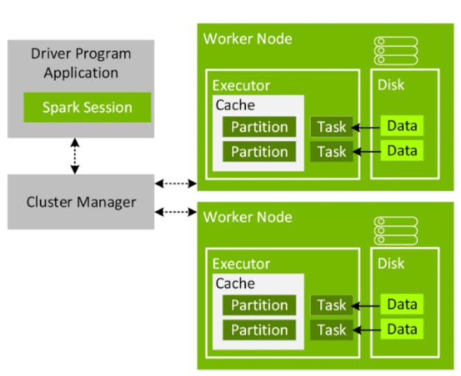

### Spark(Apache)
#### 2025-05-12 
#### Collateral : [install_spark](/../platform/install_spark.md)

### What is Spark?
+ 대규모 데이터를 처리할 수 있는 분산 시스템
+ 데이터 처리가 중단되더라도 장애를 복구 가능
+ Apache Spark는 RDD를 사용하여 스토리지에서 특정 정보를 검색하는 방법을 기억하고 기반 스토리지에 장애가 발생할 경우 데이터를 재구성
+ Spark Core: Apache Spark의 기본 기능을 조정, 메모리 관리, 데이터 스토리지, 작업 스케줄링, 데이터 처리 등
+ Spark Streaming/Structured Streaming: Spark가 데이터를 작고 연속적인 블록으로 나누어 데이터를 효율적으로 실시간 스트리밍할 수 
+ 기계 학습 라이브러리(MLlib) : 빅 데이터에 적용할 수 있는 여러 기계 학습 알고리즘을 제공
+ GraphX : 그래프를 사용하여 데이터를 시각화하고 분석

### How working? 
 

+ Role
  + Driver application : 관리자, application의 중앙처리자 같은 역할, spark session 으로 띄움
  + Cluster Manager : 실제 excutor, core리소스를 할당 역할 
  + Executor : 실제 작업을 하는 worker, 지정한 코어수 대로 내부에서 수행 
+ WorkFlow 
  1. SparkSession(실행될 task ,stage, excuter/core info 포함한)을 통해 cluster manager(YARN) 을 호출 
  2. Cluster manager에서 sparksession을 통해 전달받은 task를 기준으로 executor(요청된 memery, core가 할당된 container)를 할당 
  3. 각 executor는 HDFS(Disk)에서 데이터를 읽어와 Task단위로 실행
  4. task는 하나의 partition과 mapping되어 처리 (* 각 partition 사이의 데이터 이동을 shuffle(셔플)이라고 함)
    이 과정에서 Cluser Manager는 Driver와 executor 중간에서 상태 및 성능 정보들을 전달해줌
  5. executor의 tasks 작업이 완료되면, 해당 내용들을 Driver에 전송, driver는 해당 정보를 종합해 client에게 제공한 뒤 Application(app) 종료 

### Spark Streaming
+ 

### Difference Between Apache Frameworks - BigData
+ MR vs Spark
+ Spark vs hive
+ Spark vs Hadoop
  + (인)메모리(RAM) vs 디스크
  + 자체 네이티브 파일 시스템이 없음/HDFS(네이티브 파일 시스템)를 기반으로 대용량 데이터 블록을 여러 개의 작고 균일한 블록으로 나눈 뒤 작은 데이터 블록을 서버 그룹에 저장
  + 실시간으로 처리/데이터 세트를 배치 단위로 처리
    + Spark는 외부 스토리지에서 데이터에 액세스하지 않고, 데이터를 처리하기 전에 RAM에 복사
    + 특정 작업을 완료한 후에만 데이터를 외부 스토리지에 다시 씁니다 -> mapreduce 
  + Apache Hadoop은 하나 이상의 데이터 처리 노드에 장애가 발생하더라도 계속 실행됩니다. 동일한 데이터 블록의 복사본을 여러 개 만들어 여러 노드에 저장합니다. 한 노드에 장애가 발생하면 Hadoop은 다른 노드에서 정보를 검색하여 데이터 처리를 준비
  Apache Spark는 Resilient Distributed Dataset(RDD)라는 특수한 데이터 처리 기술을 사용