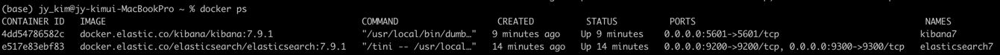

### Title: EKL 설치
#### Env : macbook pro14 m2(silicon)
#### Date : 2023-07-09
#### Desc :   

## EKL 
- ELK : ElasticSearch(분석, 저장), Logstash(수집기능), Kibana(시각화)
- 구성
   * ElasticSearch : 수집된 데이터 인덱싱, 분석, 검색
   * Logstash : 데이터 수집 및 변환, 전송
   * Kibana : 분석 결과 시각화
 

## Install Flow  
- docker 에 elasticsearch 설치
  1. 설치 : docker pull docker.elastic.co/elasticsearch/elasticsearch:7.9.1
  2. 실행 : docker run -d -p 9200:9200 -p 9300:9300 -e "discovery.type=single-node" --name elasticsearch7 docker.elastic.co/elasticsearch/elasticsearch:7.9.1
  3. 실행확인 : docker ps
     * 이미지 id 확인 명령어 : docker image list
  4. ES 설정확인 : docker exec -i -t elasticsearch7 cat /usr/share/elasticsearch/config/elasticsearch.yml
  5. 접속 url : http://0.0.0.0:5601/app/dev_tools#/console

- docker 에 Kibana 설치
  1. 설치 : docker pull docker.elastic.co/kibana/kibana:7.9.1
  2. 실행 : docker run -d --link elasticsearch7:elasticsearch -p 5601:5601 --name kibana7 docker.elastic.co/kibana/kibana:7.9.1
  3. 확인 : docker ps
  
  4. 접속 url : http://0.0.0.0:5601/app/home#/  or http://localhost:5601/app/home#/

## Elasticsearch 사용법
   * CRUD(입력, 조회, 수정, 삭제)
     * 

### 용어 정리
- 정형데이터(Structured Data) : 정해진 구조에 따라 저장된 데이터    예시) 엑셀, csv, rdbms 등
- 반정형데이터(Semi-Structured Data) : 구조 안에 대한 설명이 존재하는 데이터    예시) json, HTML,XML
- 비정형데이터(Unstructured Data) : 정해진 구조 없는 데이터   ex) 텍스트, 이미지, 영상, 워드, PDF   
- 도큐먼트(Document)
- 인덱스(index)
- 인디시스(indices)
- 색인
- 프라이머리 샤드(Primary Shard)
- 복제본(Replica)
- 마스터 노드(master node)
- 데이터 노드(data node)
