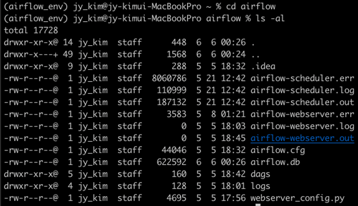
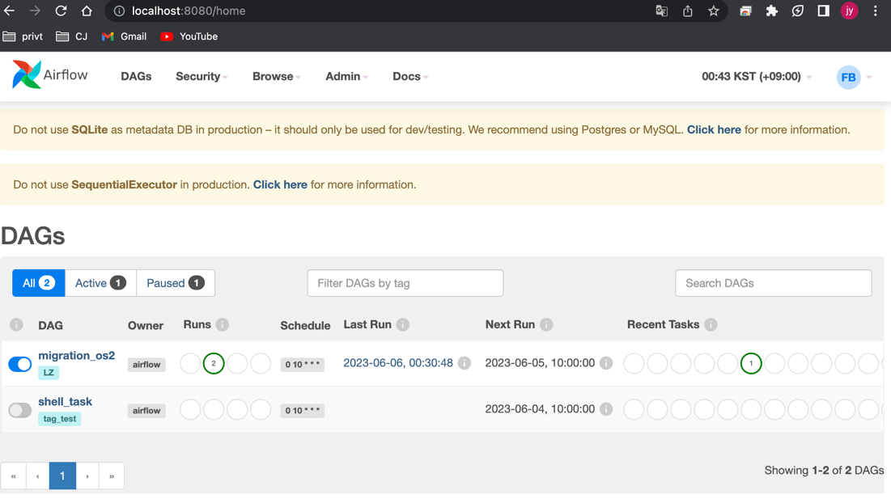
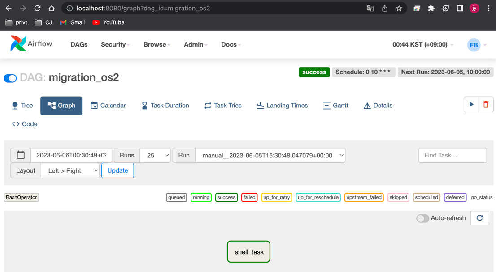
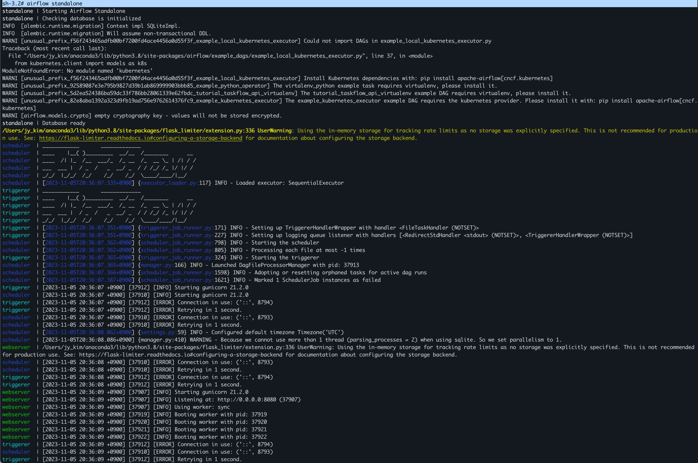
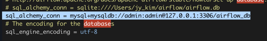
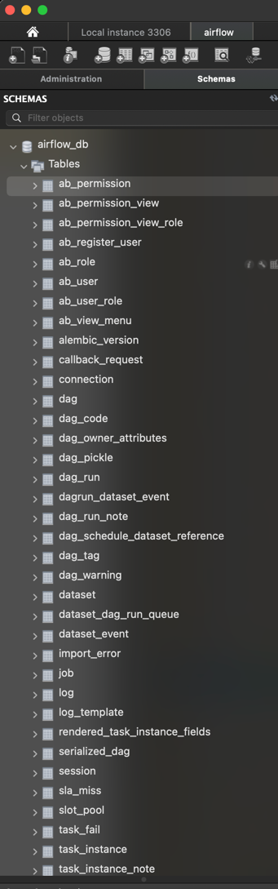

## Airflow 설치
#### Env : macbook pro14 m2(silicon)
#### Date : 2023-05-04
#### Desc : Spark version 3.4.0, Python 3.9.16, Jdk(Zulu11.64)  

## Airflow 
- 워크플로우(작업흐름) 관리 툴 
- 구성
   * Webserver : Dag 시각화 및 실행 결과 볼 수 있는 UI
   * Scheduler : worker에 dag 예약 역할
   * Executor : task 실행 정의
   * Worker : task 실제로 실행 시키는 것
   * Database : airflow 메타데이터 관리 및 저장 
   * Dag : Direct Acyclic Graph


## Install (VM)
**  install airflow on VM
1. ```brew install conda```  
2. ```pip3 install apache-airflow```  
  2-1. python 가상 환경 생성, 3.8 version 생성  
  ```conda create --name airflow_env python=3.8 -y  ```  
  2-2. 가상 환경 활성화  
  ```conda activate airflow_env  ```  
  2-3. 가상 환경에 airflow 설치   
  ```pip install "apache-airflow==2.2.3" --constraint "https://raw.githubusercontent.com/apache/airflow/constraints-2.2.3/constraints-no-providers-3.8.txt" ``` 
  2-4. db 활성화 : dag, task info 관리 하기 위해 db 사용    
  ```airflow db init```
  2-5. 디렉토리 이동 및 목록 확인      
   ```
   cd ~/airflow  
   ls -al    
   ```      
          

   2-6. airflow 계정 생성        
   ```airflow users create --role Admin --username admin --password admin --email admin@example.com --firstname foo --lastname bar  ```      
   2-7. 웹서버 시작    
   ```  
   airflow webserver -D 
   airflow webserver --port 8080  
   ```  
   2-8. 스케줄러 시작      
   ```airflow scheduler -D```  
   2-9. Airflow 시작    
   ```http://localhost:8080```  
       
3. Airflow dag project 설정 , airflow.cfg 파일에 dags_folder 에 디렉토리 지정  
   ```vi airflow/airflow.cfg```  
   ```dags_folder = /Users/jy_kim/airflow/dags ```   
       


## Install(Local)    
+  Quick ver    
+ Refer : https://airflow.apache.org/docs/apache-airflow/stable/start.html
1. ```export AIRFLOW_HOME=~/airflow```        
2. ```   
    AIRFLOW_VERSION=2.7.2   
    PYTHON_VERSION="$(python --version | cut -d " " -f 2 | cut -d "." -f 1-2)"   
    CONSTRAINT_URL="https://raw.githubusercontent.com/apache/airflow/constraints-${AIRFLOW_VERSION}/constraints-${PYTHON_VERSION}.txt"
    pip install "apache-airflow==${AIRFLOW_VERSION}" --constraint "${CONSTRAINT_URL}"
   ```         
3. Airflow 실행 명령 
    ```airflow standalone```
4. Find login info at log   (username: admin  password: UW95MrXcbytbXmy7)    
       
* Airflow의 개별 부분을 수동으로 실행 방법
    ``` 
        airflow db migrate
        airflow users create \
            --username admin \
            --firstname Peter \
            --lastname Parker \
            --role Admin \
            --email spiderman@superhero.org
        airflow webserver --port 8080
        airflow scheduler
    ``` 
## Install(Docker)
* 참고 : https://airflow.apache.org/docs/apache-airflow/stable/howto/docker-compose/index.html (Airflow Version: 2.6.3) 
1. docker yaml 가져오기    
```curl -LfO 'https://airflow.apache.org/docs/apache-airflow/2.6.3/docker-compose.yaml'```  
yaml 구성요소 
- airflow-scheduler- 스케줄러는 모든 작업과 DAG를 모니터링한 다음 종속성이 완료되면 작업 인스턴스를 트리거합니다.  
- airflow-webserver- 웹서버는 에서 사용할 수 있습니다 http://localhost:8080.
- airflow-worker- 스케줄러가 부여한 작업을 수행하는 작업자.  
- airflow-triggerer- 트리거러는 연기 가능한 작업에 대한 이벤트 루프를 실행
- airflow-init- 초기화 서비스.
- postgres- 데이터베이스.  
- redis- Redis - 스케줄러에서 작업자로 메시지를 전달하는 브로커.
2. ```  
   mkdir -p ./dags ./logs ./plugins ./config
    echo -e "AIRFLOW_UID=$(id -u)" > .env 
    ```    
3. ```docker compose up airflow-init```    
4. docker 실행 스크립트 생성 
    ```  
    curl -LfO 'https://airflow.apache.org/docs/apache-airflow/2.6.3/airflow.sh'
    chmod +x airflow.sh
   ```   
5. docker 에서 airflow (compose 사용하여) 실행 명렁어    계정정보(ID/PW) : airflow/airflow     
  ``` docker compose up```   

#### Airflow 동작방법  
- 처음 설치하면 예시 airflow 나오는데 제거 하고 싶을 때  
```airflow.cfg 에서 load_examplesFalse = False``` 로 변경 후 웹서버, 스케줄러 재시작
- 웹서버, 스케줄러 재시작 방법  
```
airflow webserver -D  
airflow scheduler -D  
```     
#### mysql 과 airflow 연동 방법 설치     
1. mysql 설치    
    ```brew install mysql```
2. airflow.cfg 에 database 경로 변경   
    ```vi airflow/airflow.cfg```    
        
3. workbench 에서 airflow db 확인    
     


#### docker compose 란??    
- 여러 개의 컨테이너(container)로 구성된 애플리케이션을 관리하기 위한 간단한 오케스트레이션(Orchestration) 도구    
##### 명령어 
- docker-compose up -d : 모든 서비스 컨테이너를 한 번에 생성/실행하기 위해서 사용 (-d : working background )
- docker-compose down : 모든 서비스 컨테이너를 한 번에 종료
- docker-compose start [특정 서비스이름] : 특정 서비스 컨테이너를 올리기 위해 
- docker-compose stop [특정 서비스이름] : 특정 서비스 컨테이너를 종료하기 위해 


#### 용어 정리  
- webserver : 웹 UI 제공 역할
- schedule : excutor 에게 task 제공 역할
- excutor : 실행중 task 컨트롤 하는 컴포넌트
- worker : task 실행하는 주체
- database : metadata 정보 저장 관리(airflow.cfg에서 설정)
- Dag : Directed Acyclic Grapth, 단방향 노드


