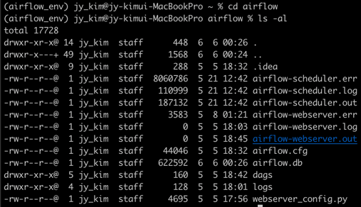
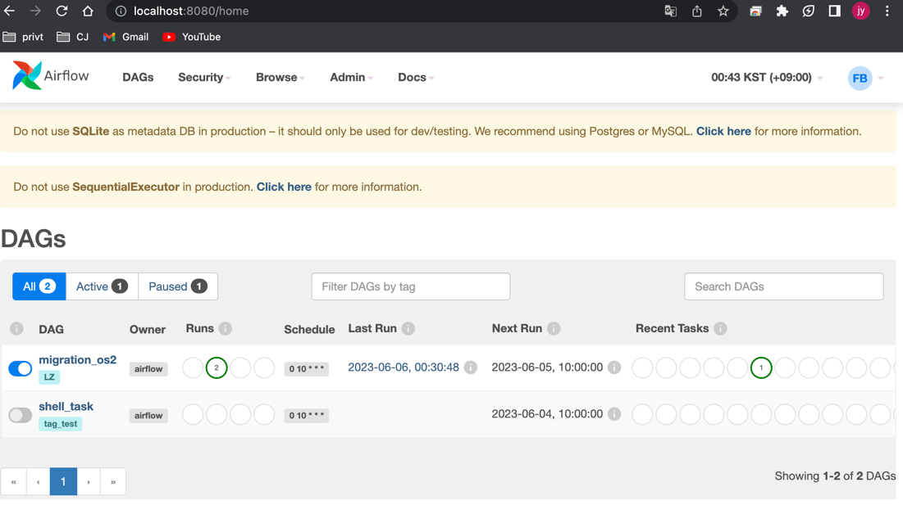
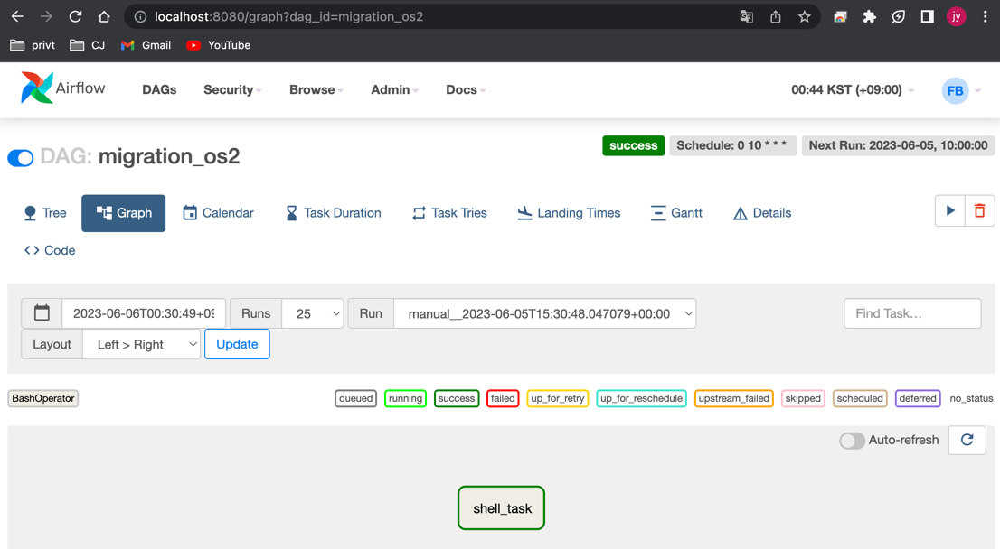

### Title: Airflow 설치
#### Env : macbook pro14 m2(silicon)
#### Date : 2023-05-04
#### Desc : Spark version 3.4.0, Python 3.9.16, Jdk(Zulu11.64)  

## Airflow 
- 워크플로우(작업흐름) 관리 툴 
- 구성
   * Webserver : Dag 시각화 및 실행 결과 볼 수 있는 UI
   * Scheduler : worker에 dag 예약 역할
   * Executor : task 실행 정의
   * Worker : task 실제로 실행 시키는 것
   * Database : airflow 메타데이터 관리 및 저장 
   * Dag : Direct Acyclic Graph


## Install Flow  
** mac silicon 칩은 가상환경 설치만 가능 (2023.05.01 기준)
1. ```brew install conda```  
2. ```pip3 install apache-airflow```  
  2-1. python 가상 환경 생성, 3.8 version 생성  
  ```conda create --name airflow_env python=3.8 -y  ```  
  2-2. 가상 환경 활성화  
  ```conda activate airflow_env  ```  
  2-3. 가상 환경에 airflow 설치   
  ```pip install "apache-airflow==2.2.3" --constraint "https://raw.githubusercontent.com/apache/airflow/constraints-2.2.3/constraints-no-providers-3.8.txt" ``` 
  2-4. db 활성화 : dag, task info 관리 하기 위해 db 사용    
  ```airflow db init```
  2-5. 디렉토리 이동 및 목록 확인      
   ```
   cd ~/airflow  
   ls -al    
   ```      
          

   2-6. airflow 계정 생성        
   ```airflow users create --role Admin --username admin --password admin --email admin@example.com --firstname foo --lastname bar  ```      
   2-7. 웹서버 시작    
   ```  
   airflow webserver -D 
   airflow webserver --port 8080  
   ```  
   2-8. 스케줄러 시작      
   ```airflow scheduler -D```  
   2-9. Airflow 시작    
   ```http://localhost:8080```  
       
3. Airflow dag project 설정 , airflow.cfg 파일에 dags_folder 에 디렉토리 지정  
   ```vi airflow/airflow.cfg```  
   ```dags_folder = /Users/jy_kim/airflow/dags ```   
       


#### Airflow 동작방법  
- 처음 설치하면 예시 airflow 나오는데 제거 하고 싶을 때  
```airflow.cfg 에서 load_examplesFalse = False``` 로 변경 후 웹서버, 스케줄러 재시작
- 웹서버, 스케줄러 재시작 방법  
```
airflow webserver -D  
airflow scheduler -D  
```  
- mysql 설치  
```brew install mysql```

#### 용어 정리  
- webserver : 웹 UI 제공 역할
- schedule : excutor 에게 task 제공 역할
- excutor : 실행중 task 컨트롤 하는 컴포넌트
- worker : task 실행하는 주체
- database : metadata 정보 저장 관리(airflow.cfg에서 설정)
- Dag : Directed Acyclic Grapth, 단방향 노드


