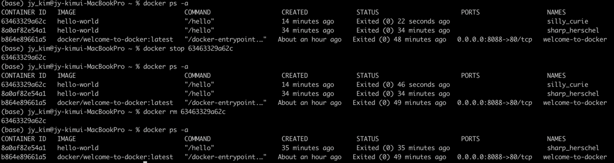
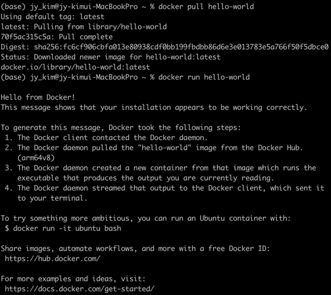
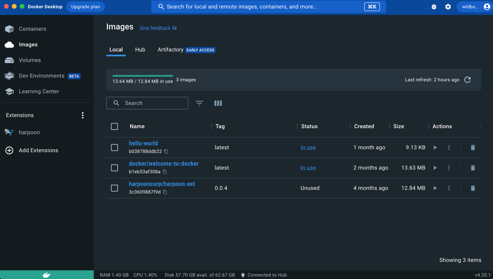
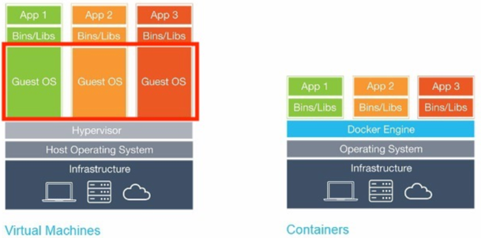
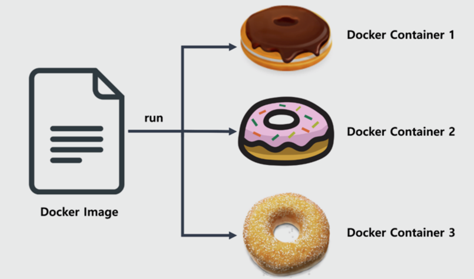

### Title:  도커설치 
#### Env : macbook pro14 m2(silicon), Spark version 3.4.0, Python 3.9.16, Jdk(Zulu11.64)
#### Date : 2023-03-04 
#### Desc : brew cask 이용하여 설치, myssql 설치
##### (** home homebrew 설치방법 : /bin/bash -c "$(curl -fsSL https://raw.githubusercontent.com/Homebrew/install/HEAD/install.sh)" )
<br/><br/>

## Install Flow
1. 도커 설치 명령  
``` brew install --cask docker```  
2. Local에서 Docker Desktop 확인 하기
<br/><br/>


## Docker 명령어  
- 버전 확인 : docker -v   
- Image 가져오기 : docker pull [이미지이름]     ex> docker pull hello-world
- Image 실행 : docker run [이미지이름]     ex> docker run hello-world
- Image/Containor 삭제 : docker rmi [이미지 이름 or id]
- 이미지 목록 : docker image list  
- 컨테이너 목록 : docker ps -a  
- 컨테이너 종료 : docker stop [컨테이너 이름]  
- 컨테이너 삭제 : docker rm [컨테이너 id]  
     


## Image 생성/실행
1. Image 가져오기 : docker pull [이미지이름]     ex> docker pull hello-world
2. Image 실행 : docker run [이미지이름]     ex> docker run hello-world  
     
     


<br/><br/>
### 개념정리
-  Docker 와 VM(virtual machine)의 차이 및 개념    
     -  VM: 하이퍼바이저 기반, 논리적으로 구분된 가상환경(게스트 os)이 별도로 존재
     -  Docker : 커널 기반, 단일 os위에 다수 응용프로그램 실행 방식, 다양한 응용프로그램을 컨테이너로 실행/관리하는 오픈소스 프로젝트, 
     -  차이점 : 게스트 os의 유무(다양한 os 요구될땐 =>VM    단일 os => docker)  
     
-  Host OS vs Guest OS       
     - Host OS : 기존에 설치 되어있는 os (default)  
     - Guest OS : 기존이외 os , vm에서 존재  ex> 한 리눅스 서버에 window, 우분투 두개 올려서 사용 할 때  
-  brew 와 brew cask 설치 차이점  
     - brew로 설치는 가상머신 위에 도커를 띄우는 작업이 필요 => 가상머신 설치 별도 요구  
     - brew cask 설치는, desktop에 직접 설치, 맥 os 위에 바로 설치하기 때문에 가상머신 불필요
 <br/><br/>

### 용어 정리
- image : 컨테이너를 실행할 수 있는 실행파일, 설정값 가지고 있음  
- docker-container : 도커 이미지를 실행한 상태, 단일 컴퓨터 호스트를 리소스를 가상으로 여러개 사용할 수 있도록 하는 sw  
       
** 도커 이미지를 변경해도 이미 실행 중인 도커 컨테이너에는 영향 없음    
- -하이퍼바이저(hypervisor) : 여러 os를 동시에 실행하기 위한 논리적 플랫폼, 다수의 가상 머신을 분산 시키는 역할  
- 커널(kernel) : hw 와 sw를 연결해주는 역할 ,shell 을 통해 응용 application과 소통
- docker-compose :
- docker-machine :
- on premise : 온 프레미스
- off premise :


