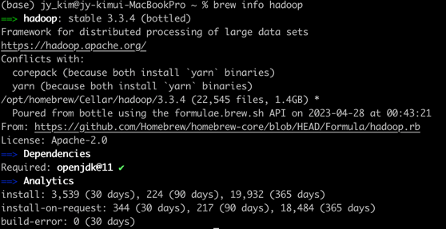
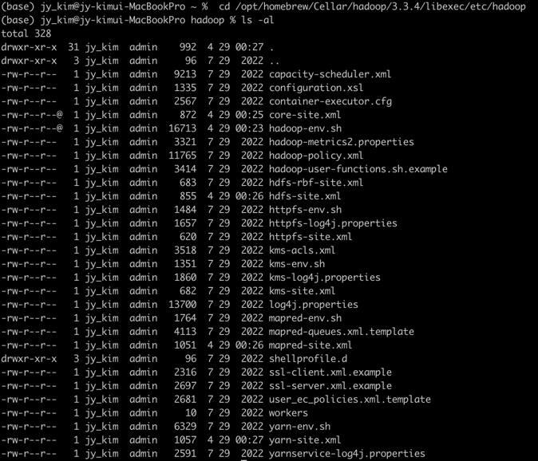
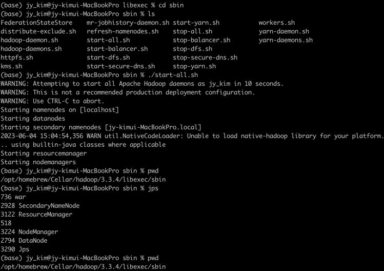
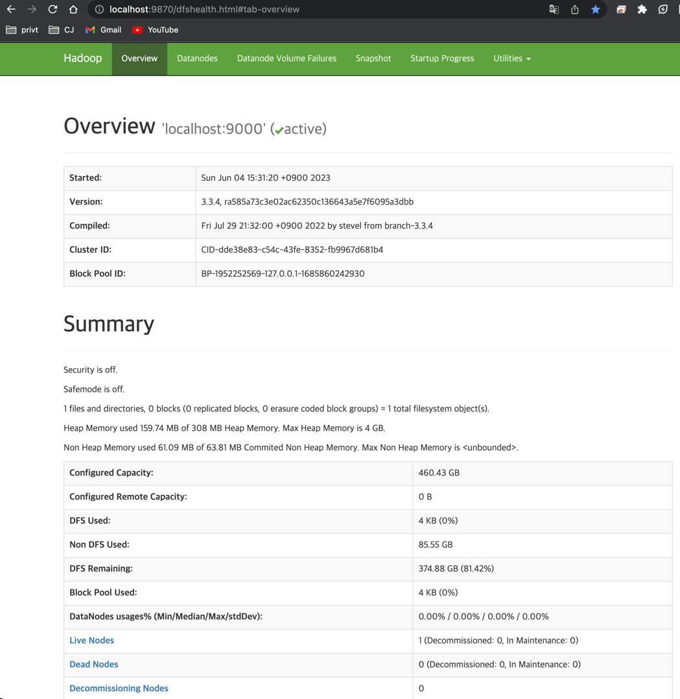
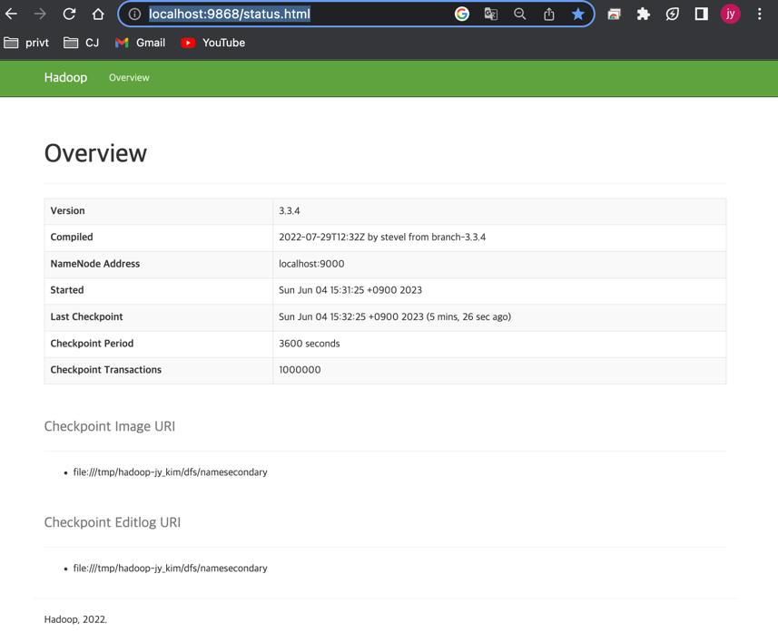
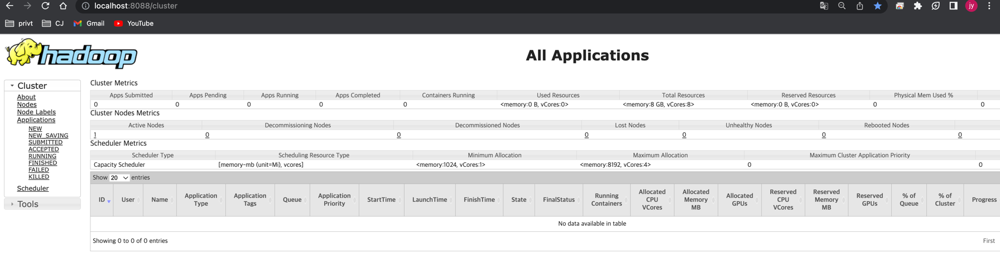
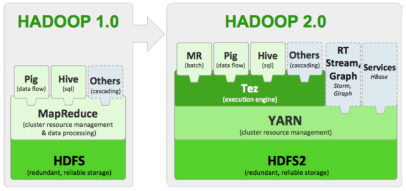

### title: hadoop 설치
#### env : macbook pro14 m2(silicon)
#### date : 2023-02-04
#### desc : hadoop ver. 3.3.4, jdk ver. zulu-11.jdk  
#### reference   
<br/><br/>

## Hadoop
- 동작방식  
- 메커니즘  
- 사용이유  
<br/><br/>

## Hadoop Install Flow
1. hadoop 설치 : brew install hadoop    
    ** homebrew install 명령어 : /bin/bash -c "$(curl -fsSL https://raw.githubusercontent.com/Homebrew/install/HEAD/install.sh)"  
2. 버전 및 경로확인 : brew info hadoop      
       
3. jdk 설치  
4. 환경 변수 설정      
   4-1. 환경변수 디렉토리 이동 : cd /opt/homebrew/Cellar/hadoop/3.3.4/libexec/etc/hadoop  
        
   4-2. JAVA_HOME 추가 : vi hadoop-env.sh  >  export JAVA_HOME="/Library/Java/JavaVirtualMachines/zulu-11.jdk/Contents/Home"    
   4-3. 파일설정    
   * vi core-site.xml   
       ```    
       <configuration>
         <property>
           <name>fs.defaultFS</name>
           <value>hdfs://localhost:9000</value>
         </property>
       </configuration>
       ```  
   * vi hdfs-site.xml
      ```    
      <configuration>
        <property>
          <name>dfs.replication</name>
          <value>1</value>
        </property>
      </configuration>
     ```     
   * vi mapred-site.xml
      ```    
      <configuration>
        <property>
          <name>mapreduce.framework.name</name>
          <value>yarn</value>
        </property>
        <property>
          <name>mapreduce.application.classpath</name>
          <value
          >      $HADOOP_MAPRED_HOME/share/hadoop/mapreduce/*:$HADOOP_MAPRED_HOME/share/hadoop/mapreduce/lib/*</value
        >
        </property>
      </configuration>
      ```  
   * vi yarn-site.xml  
     ```    
        <configuration>
          <property>
            <name>yarn.nodemanager.aux-services</name>
            <value>mapreduce_shuffle</value>
          </property>
          <property>
            <name>yarn.nodemanager.env-whitelist</name>
            <value
          >      JAVA_HOME,HADOOP_COMMON_HOME,HADOOP_HDFS_HOME,HADOOP_CONF_DIR,CLASSPATH_PREPEND_DISTCACHE,HADOOP_YARN_HOME,HADOOP_HOME,PATH,LANG,TZ,HADOOP_MAPRED_HOME</value
        >
          </property>
      </configuration>
     ```    
5. ssh 확인 및 실행  
    5-1.   
            
    5-2. mac 에서 5-1 이 실행안된다면 : 환경설정 > 공유 > 원격로그인 활성   
    5-3. ssh keygen 발급  
    ```   
    ssh-keygen -t rsa -P '' -f ~/.ssh/id_rsa
    cat ~/.ssh/id_rsa.pub >> ~/.ssh/authorized_keys
    chmod 0600 ~/.ssh/authorized_keys
    ```  
6. hadoop 실행 명령  
   - cd /opt/homebrew/Cellar/hadoop/3.3.4/libexec/sbin    
   - 실행 : ./start-all.sh  
   - 실행 확인   
     - jps     
            
     - namenode 확인 : http://localhost:9870/dfshealth.html#tab-overview    
          
     - Secondary NameNode 확인 : http://localhost:9868/status.html  
          
     - 리소스 매니저 확인 : http://localhost:8088/cluster  
          
<br/><br/> 

## Hadoop 제어 명령어  
- 네임노드 포멧 : hadoop namenode -format ([hadoop java.net.connectexception:연결이 거부됨] 에러 발생시 해결방법)
- jdk 경로 확인 : cd /Library/Java/JavaVirtualMachines  
<br/><br/>

### 용어 정리  
- hdfs : 하둡 분산형 파일 시스템(Hadoop Distributed File System), HDFS는 데이터에 대한 액세스를 제공하는 하둡의 파일 시스템, 하둡의 모듈  
- hadoop : 데이터 저장, 처리 및 분석할 수 있는 오픈 소스 프레임워크  
- datanode : 데이터 처리
- namenode : 데이터 정보와 속한 블록 크기, 데이터의 이동 위치, 권한(읽기, 쓰기, 제거, 복제) 갖고 있는 노드
- Secondary NameNode : HDFS 작업을 트랜잭션 로그를 기록하는 역할 
- mapreduce : 수천대 기계에서 병렬 처리 위한 프레임워크, 배치지향성, map운 (Key, Value) 형태 생성, Reduce는 map 에서 나온 key값으로 데이터 추출하는 역할 ,reduce 과정에서 shuffle 발생 
- yarn : 
- Stand alone(Local) :
- Pseudo-Distributed Mode :
- Fully-Distributed Mode :
- JVM : 
- tez : excution engine 
- yarn :
- hive on mr : I/O 과정에서 write 발생
- hive on tez : I/O 과정에서 write 미발생, 속도향상
     