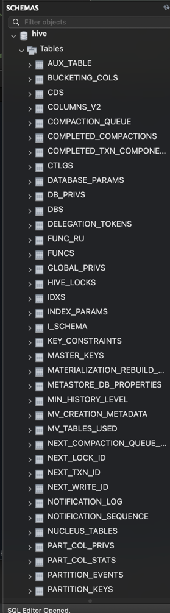
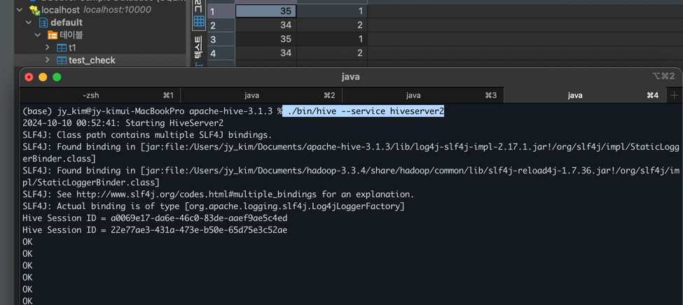
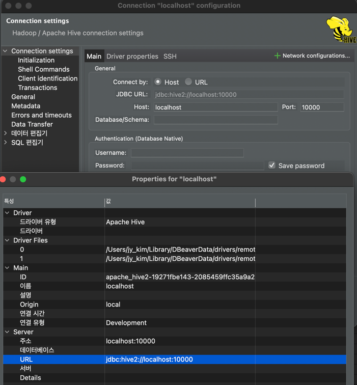
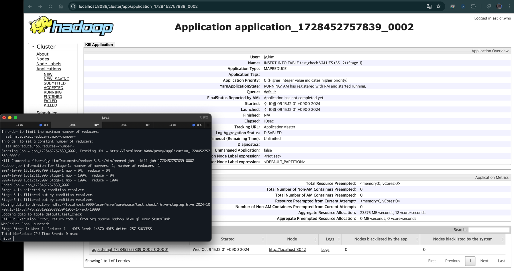
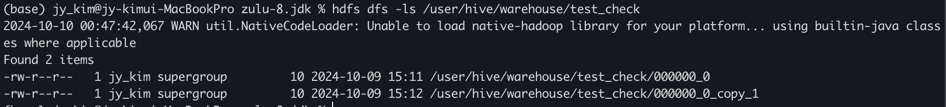

### Apache hive 설치
#### env : macbook pro14 m2(silicon), hive ver.3.1.3, jdk ver. zulu-8.jdk, hadoop ver. 3.3.4, mysql ver. 9.0.1
#### date : 2024-09-25
  
#### reference :  
+ https://key4920.github.io/docs/bigdata_platform/Hadoop/hadoop_install_M1/
+ https://sparkwithdots.medium.com/setup-mini-data-lake-and-platform-on-m1-mac-part-4-eda1c8a93917

<br/><br/>

## Hive
+ hive 는 hadoop이 있어야 사용 가능
  + hdfs 데이터 조회 쿼리 용도 
+ SQL 과 유사한 HiveQL을 표준 사용
<br/><br/>

## Hive Install Flow
1. [hive 3.1.3 설치 Link](https://downloads.apache.org/hive/hive-3.1.3/apache-hive-3.1.3-bin.tar.gz)     
    사전 hadoop 설치 반드시 필요, [Hadoop 설치 참조](./install_hadoop.md)   
    사전 mysql 설치 반드시 필요, [Hadoop 설치 참조](./install_mysql.md)      
    [JAVA8 설치 URL](https://www.azul.com/core-post-download/?endpoint=zulu&uuid=7b991cc1-0d5e-403f-a271-7cd622f1cb03)        
    [JAVA8 설치 방법](https://velog.io/@jiisuniui/%EC%8B%B8%ED%94%BCssafy%EC%9D%B8%EB%93%A4%EC%9D%84-%EC%9C%84%ED%95%9C-%EB%A7%A5%EB%B6%81mac-OS-M1-Monterey-Java8-Zulu-%EC%84%A4%EC%B9%98-%EB%B0%8F-%ED%99%98%EA%B2%BD%EB%B3%80%EC%88%98-%EC%84%A4%EC%A0%95)
2. ~/.bashrc hive 파일 경로 등록       
      ```export HIVE_HOME=/Users/jy_kim/Documents/apache-hive-3.1.3/bin```    
3. mysql 설정
   1. mysql root 계정 접속
         ```mysql -u root -p root```
   2. hive metastore database 생성 
    ```
        CREATE DATABASE metastore;
        USE metastore;
        create user 'hive@'%' identified by 'hive'; 
        grant all privileges on metastore.* to hive@'%' identified by 'hive';
        flush privileges;  
        exit;                    # root 계정 나온 뒤   
        mysql -u hive -p hive;   # hive 계정 로그인    
        create database hive;    # hive metastore DB 생성
    ```
4. hdfs 폴더 생성 
    ```
        hadoop fs -mkdir /tmp
        hadoop fs -mkdir -p /user/hive/warehouse
        hadoop fs -chmod g+w /tmp
        hadoop fs -chmod g+w /user/hive/warehouse
    ```
5. hive-site.xml/hive-env.sh(파일 없을 경우 새로 생성, *.template copy 해도 됨) 설정
    ```
        cd /Users/jy_kim/Documents/apache-hive-3.1.3/conf
        vi hive-site.xml 
    ```
   하위 내용 입력        
      ** createDatabseIfNotExist=true : 별도 DB 없을 경우 자동 생성       
      ** javax.jdo.option.ConnectionUserName : mysql hive metastore 계정 사용자이름       
      ** javax.jdo.option.ConnectionPassword : mysql hive metastore 계정 비밀번호

    ```
        <?xml version="1.0" encoding="UTF-8" standalone="no"?>
        <?xml-stylesheet type="text/xsl" href="configuration.xsl"?>
        <configuration>
        <property>
           <name>hive.metastore.local</name>
           <value>false</value>
        </property>
        <property>
           <name>hive.metastore.warehouse.dir</name>
          <value>hdfs://master:9000/user/hive/warehouse</value>
        </property>
        <property>
           <name>javax.jdo.option.ConnectionURL</name>
           <value>jdbc:mysql://localhost:3306/hive?createDatabaseIfNotExist=true</value>
        </property>
        <property>
           <name>javax.jdo.option.ConnectionUserName</name>
           <value>hive</value>
        </property>
        <property>
           <name>javax.jdo.option.ConnectionPassword</name>
           <value>hive</value>
        </property>
        </configuration>
    ```
   ```
        cd /Users/jy_kim/Documents/apache-hive-3.1.3/conf
        vi hive-env.sh 
   ```
    하위 HADOOP_HOME 변경 
   ```
        HADOOP_HOME=/usr/local/hadoop-2.8.5
   ``` 
6. HIVE_HOME 설정(bash_profile 또는 zshrc)
   ```
   cd .. 
   vi ~/.bash_profile 
   source ~/.bash_profile

   vi ~/.zshrc
   source ~/.zshrc
   ``` 
7. hive 연동 확인 
    ```
        cd /Users/jy_kim/Documents/apache-hive-3.1.3
        ./bin/schematool -dbType mysql -initSchema
    ``` 
                       
   hive 연결           
    ```
        cd /Users/jy_kim/Documents/apache-hive-3.1.3
        ./bin/hive --service hiveserver2        # hive 조회 
        ./bin/hive --service metastore          # hive 메타스토어 연결 
    ``` 
8. hive test 
   1. 테이블 생성    
   ```
    # 생성
   create table test_check(
        test int,
        check int 
   );
    ``` 
   2. dbeaver 접속 확인, 데이터 조회     
         
       
   3. 데이터 삽입 및 조회 
        ```
        # 생성    
            INSERT INTO TABLE test_check VALUES (35, 1), (34, 2); 
        # 조회 
            select * from test_check ;
         ```        
                        
   4. hdfs 확인         
              
   
 

## Hadoop 제어 명령어  
- 네임노드 포멧 : hadoop namenode -format ([hadoop java.net.connectexception:연결이 거부됨] 에러 발생시 해결방법)
- jdk 경로 확인 : cd /Library/Java/JavaVirtualMachines  
<br/>


## Solved Problem
+ 문제 : ./bin/schematool -dbType mysql -initSchema -- verbose 시  Public Key Retrieval is not allowed 발생 
    + 해결방안 :  MySql 8.0 이후부터는 계정 생성과 권한 부여를 한 번에 할 수 없음(사용 mysql ver. 9.0.1)
        ```   
            mysql> create user 계정ID@'%' identified by '비밀번호';   # create user hive@'%' identified by 'hive';   
            mysql> grant all privileges on DB이름.* to 계정ID@'%';     # grant all privileges on hive.* to hive@'%';
            mysql> flush privileges;  
        ```  
    + 출처 : https://nonaninona.tistory.com/58
+ 문제 : MySQL server version for the right syntax to use near 'identified by 
    + 해결방안 :  apache-hive-3.1.3/conf/hive-site.xml 에   ```allowPublicKeyRetrieval``` 옵션 추가 
    + 출처: https://118k.tistory.com/1066  
+ 문제 : 하이브 실행(./bin/hive) 후 create table 안되는 현상 
    + 발생 에러 : FAILED: HiveException java.lang.RuntimeException: Unable to instantiate org.apache.hadoop.hive.ql.metadata.SessionHiveMetaStoreClient
    + 해결방안 : ```./bin/hive --service metastore``` 메타스토어 시작 후 hive 실행 
+ 문제 : ./bin/hive 실행 안됨 (원인: hadoop version 문제)      
    + 발생 현상 : hadoop 3.4.0 과 hive3.1.3 문제 
    + 해결방안 :  hadoop Downgrade 3.3.4
    + 출처 : https://lygon55555.medium.com/hive-%EC%8B%A4%ED%96%89%EC%9D%B4-%EC%95%88-%EB%90%A0-%EB%95%8C-%ED%95%B4%EA%B2%B0-%EB%B0%A9%EB%B2%95-6e4bfbb3dcd9
<br/><br/>


### 용어 정리