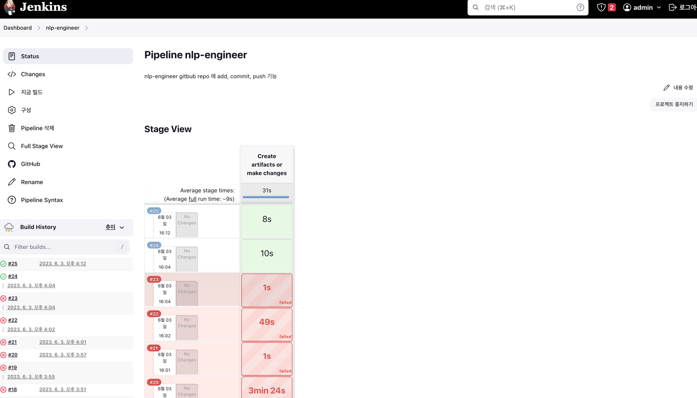
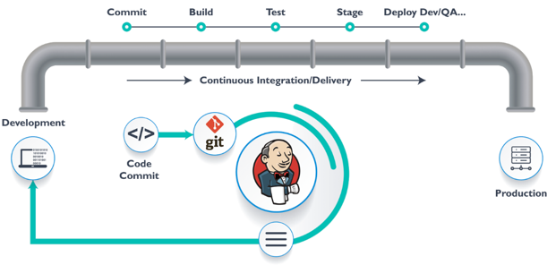
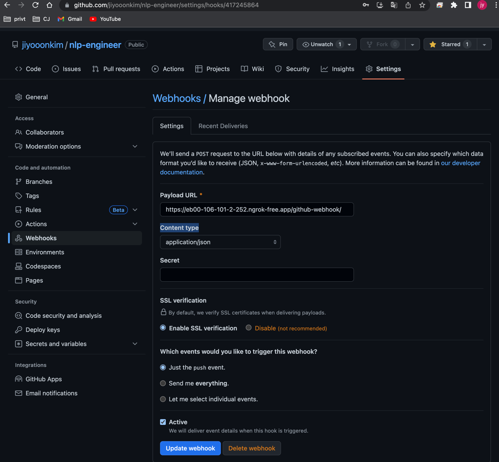
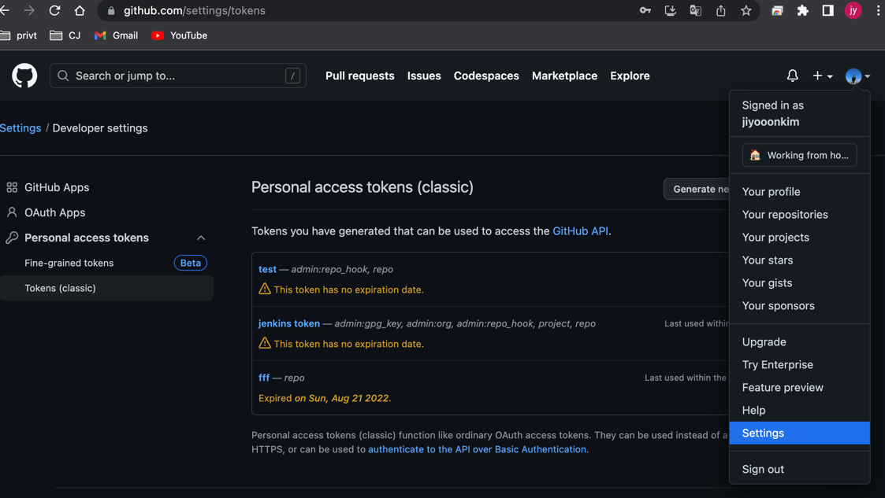
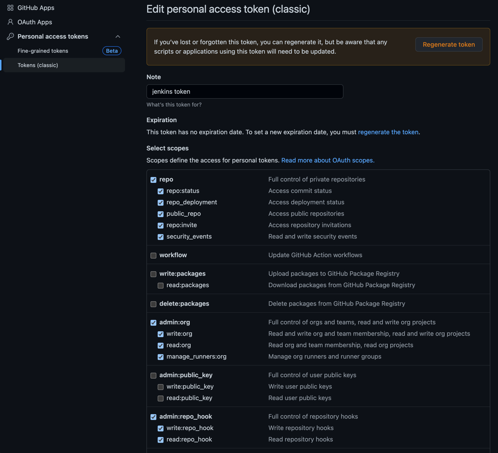
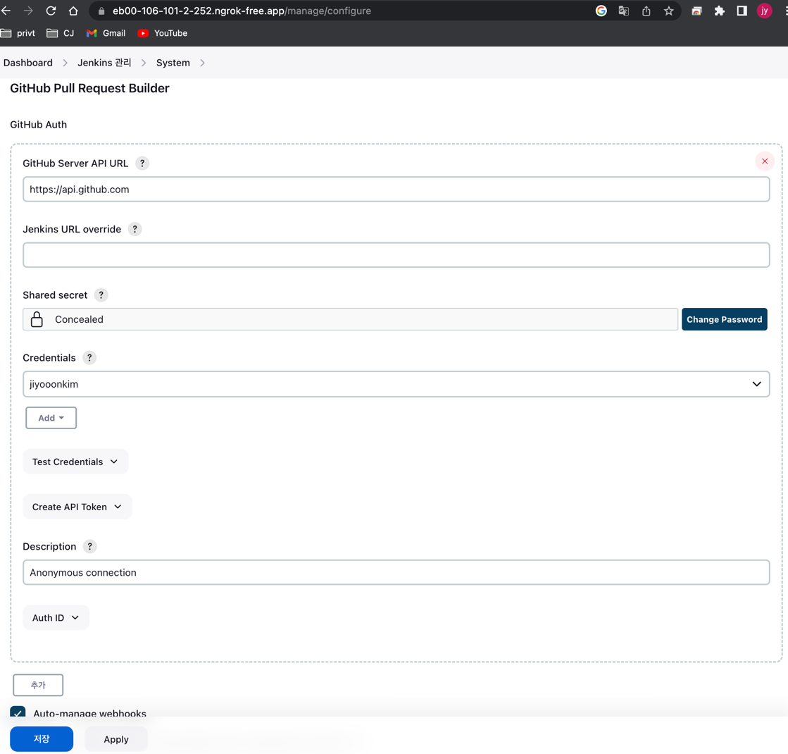
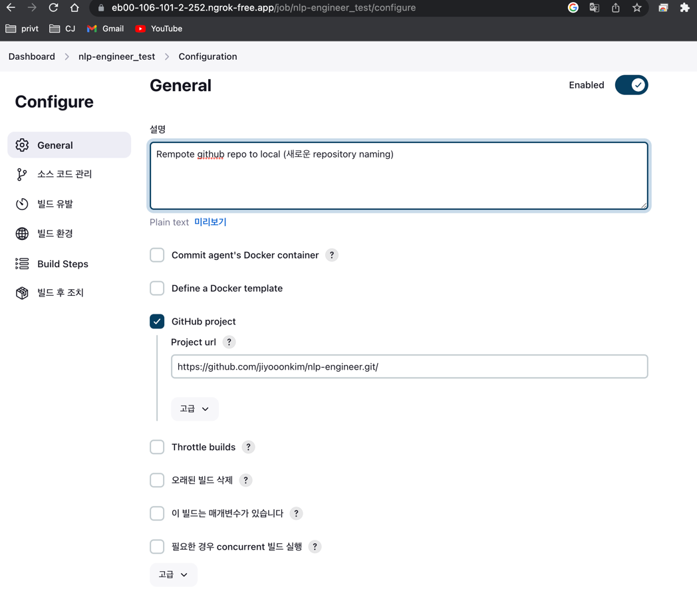
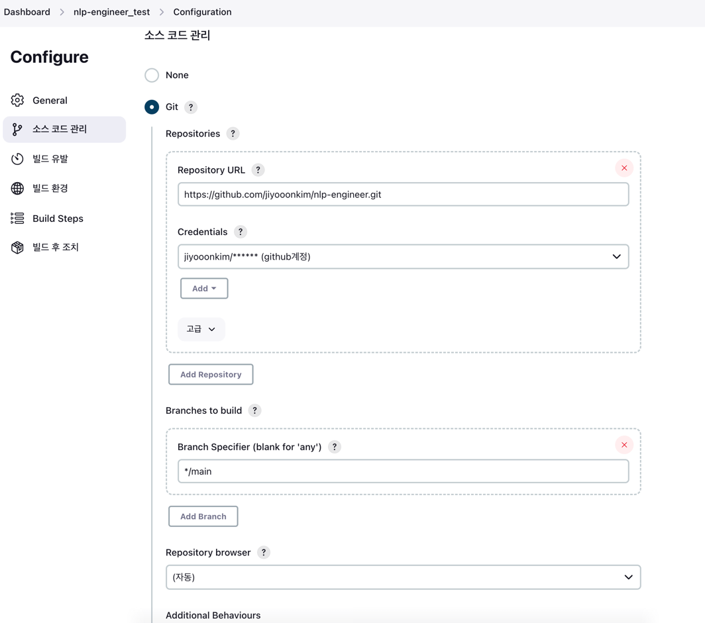
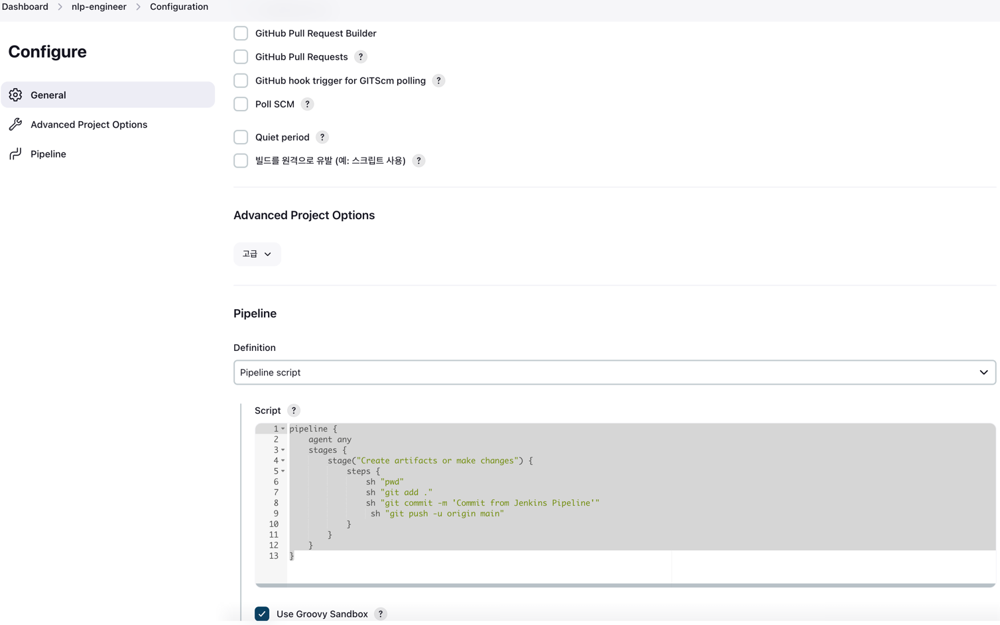

###  CI/CD 구축
#### env : macbook pro14 m2(silicon)
#### date : 2023-05-31 ~ 2023-06-04
#### desc : jenkins 설치 github repository 와 연동, jenkins 이용하여 git (add, commit ,push) build 기능
#### reference : https://medium.com/eum-tech-lab/github-webhooks%EC%97%90%EC%84%9C-localhost%EB%A5%BC-%EC%82%AC%EC%9A%A9%ED%95%A0-%EC%88%98-%EC%97%86%EB%8A%94-%EC%9D%B4%EC%9C%A0-9c0d2aecf118
  

## CI/CD
- 소스 배포 통합하기 위한 오픈소스 자동화 도구 
- 기능 : 빌드, 문서화, 테스트, 패키지, 배포
- master, slave로 구성 가능
  - master : 
  - slave : 
- #### CI/CD Flow
- 

## Install Jenkins 
 1. brew install jenkins         # 설치 명령어  
 2. brew services start jenkins  # 시작  
 3. http://localhost:8080/       # UI 접속  
 4. cat /Users/jy_kim/.jenkins/secrets/initialAdminPassword  # password 초기화  
 5. select plugin                # plugin 설치  
 6. 계정 정보 입력 후 완료  
 7. http://jenkins:8084/ 접속 하여 확인    

## Install ngrok  
 - 문제 : GitHub 에 jenkins address( localhost 사용 시) 발생하는 에러  
"There was an error updating your hook: Sorry, the URL host localhost is not supported because it isn't reachable over the public Internet"  발생
&nbsp; 원인 : gitHub는 나의 private location을  알 수 없음, Jenkins를 로컬에서 실행시, 로컬환경을 인터넷으로 노출
 - ngrok 실행 방법
   - a. ngrok 계정 생성 및 토큰 발행
   - b. 터미널 실행 후 "ngrok http 8084"(jenkins 포트번호) 입력
   - c. Forwarding 주소 가져와 git repository > setting > webhooks > payloadURL( ex> https://3e9c-121-167-202-158.ngrok-free.app/github-webhook/) 입력

## Jenkins & github 연동
1. github 설정  
   a. gitbub repository > setting > webhooks > add webhook (ngrok 에서 발급받은 payload URL(https://eb00-106-101-2-252.ngrok-free.app/github-webhook/) 입력)  
            
   b. github > settings > persional access tokens(classic) > generate new token  
          
   c. check repo, admin:org ...   
        
2. Jenkins 설정  
   a. jenkins dashboad 화면 > jenkins 관리 탭 > system  github 정보 입력
          
   b. Credentials > Add > Jenkins > Username(github ID), Password(github token), ID
   c. +새로운 Item > Enter an item name 입력 > Freestyle project 
          
            

## Jenkins에서 Github 배포 파이프라인 구성  
refer : https://itnext.io/jenkins-tutorial-part-10-work-with-git-in-pipeline-b5e42f6d124b
1. +새로운 Item > Enter an item name 입력 > Pipeline       
2. GitHub project 에 git url 입력 > Pipeline script 입력           
        

## Jenkins 제어 명령어  
- 시작 : brew services start jenkins
- 종료 : brew services stop jenkins
- 재시작 : brew services restart jenkins
- port 변경 : vi /opt/homebrew/Cellar/jenkins/2.407/homebrew.mxcl.jenkins.plist

###  용어 정리
- CI : 지속적인 통합(Continuous Integration)
- CD : 지속적인 배포Continuous Delivery