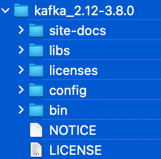
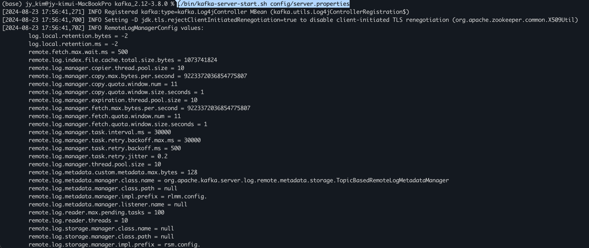

## Kafka 설치
#### Env : macbook pro14 m2(silicon)
#### Date : 2024-08-23
#### version : kafka_2.12-3.8.0  
#### refer     
+ https://velog.io/@kimview/MacOS-kafka-%EC%84%A4%EC%B9%98     
+ https://gray-hat.tistory.com/95      


## Kafka 
+ 


## Install  
1. [Apache Kafka Download Link](https://www.apache.org/dyn/closer.cgi?path=/kafka/3.8.0)      
          
2. zookeeper 구동            
 ``` ./bin/zookeeper-server-start.sh config/zookeeper.properties ```     
3. kafka 구동          
 ``` ./bin/kafka-server-start.sh config/server.properties```       
     
4. 토픽(topic) 생성
 ``` ./bin/kafka-topics.sh --create --topic new-topic --bootstrap-server localhost:9092 --replication-factor 1 --partitions 1 ```
5. 토픽리스트 확인
 ``` ./bin/kafka-topics.sh --list --zookeeper localhost:2181 ```

6. 메시지 발행(Producer)
 ``` ./bin/kafka-console-producer.sh --topic new-topic --bootstrap-server localhost:9092 ```

7. 메시지 구독(Comsumer)
 ``` ./bin/kafka-console-consumer.sh --topic new-topic --from-beginning --bootstrap-server localhost:9092 ```


