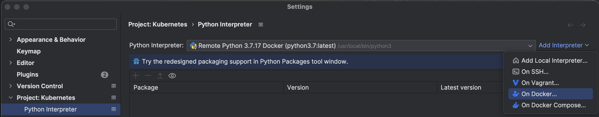

### Kubeflow 설치
#### env
    + Sonoma 14.3.1 (M2 pro)
    + kubeflow
    + minikube 1.32.0      (minikube version)
    + kubernetes 1.24.1  (kubectl version)
    + Docker 4.24.0        (docker --version) 
#### reference : https://otzslayer.github.io/mlops/2023/07/13/install-kubeflow-in-apple-silicon.html   
<br/><br/> 

#### Install 
1. Docker 설치      
   ```  https://docs.docker.com/desktop/install/mac-install/   ```
2. kustomize 설치
    ```
        wget https://github.com/kubernetes-sigs/kustomize/releases/download/kustomize%2Fv5.0.0/kustomize_v5.0.0_darwin_arm64.tar.gz
        tar -zxvf kustomize_v5.0.0_darwin_arm64.tar.gz
        chmod +x kustomize
        sudo mv kustomize /usr/local/bin
        kustomize version     # Check kustomize version
    ```
3. minikube 설치     
    ```brew install minikube ```      
4. minikube로 Kubernetes 띄우기     
    ```  minikube start --driver=docker --kubernetes-version=1.24.1 --disk-size 60g --memory 10240 --cpus 8 --profile kubeflow ```        
5. Kubeflow 설치(branch 1.7 version)               
    ```
        git clone https://github.com/kubeflow/manifests.git --branch v1.7.0
        cd manifests
        while ! kustomize build example | awk '!/well-defined/' | kubectl apply -f -; do echo "Retrying to apply resources"; sleep 10; done. ()
    ```         
   [참고 URL]  https://mlops-for-all.github.io/docs/setup-components/install-components-kf/       

6. manifest 변경하기 : https://github.com/hwang9u/manifests/commit/7008414a59ddb251d79ba2f16a87c5acf7d83d12      
┗ 미반영시 : ImagePullBackOff, PodInitializing, ERRO 발생 함      
Mac silicon (ARM CPU)에서 주로 발생하는 걸로 유명함, vinaychandran 변경 반영하기      

7. 설치 확인       
 ```kubectl get pods --all-namespaces```      
8. KubeFlow UI 접속 및 확인       
 ```kubectl port-forward svc/istio-ingressgateway -n istio-system 8080:80```     
초기 계정정보     
Email Address: user@example.com     
Password: 12341234     
9. Kubernets Dashborad 띄우기         
 ``` Kubernetes dashboard 띄우기 : minikube dashboard -p kubeflow(or profile name)```        


### Docker 명령어
+ 정상 작동 확인     
 ```  docker ps	 ```     
+ 이미지 이름 변경    
 ```  docker tag IMAGE_ID new_image:latest  ``` 
+ 버전 확인     
 ```   docker --version  ```      
+ Docker 삭제 명령어        
``` 
    /Applications/Docker.app/Contents/MacOS/uninstall
    rm -rf ~/Library/Group\ Containers/group.com.docker
    rm -rf ~/Library/Containers/com.docker.docker
    rm -rf ~/.docker    
``` 

### Kubernetes Log 확인 명령     
``` 
    kubectl logs -n [] []
    kubectl logs -n istio-system authservice-0
    kubectl logs -n kubeflow katib-controller-7ff4749ffb-gbsbp
``` 

### Kubernetes Profile 지정    
``` 
    minikube dashboard  명령 default profile 지정 
    minikube profile [프로필 명]
``` 
+ Ex) minikube profile kf-1.4 -> minikube dashboard       
[참고 URL] https://velog.io/@baeyuna97/온프레미스로-kubeflow-구축하기

### Docker python과 pycharm 연동      
``` 
    vi Dockerfile                   # 도커 파일 생성 (도커 파일은 생성자 없는 파일)
    vi requirements.txt             # 라이브러리 생성
    docker build --tag python3.7    # 실행 
    docker images                   # 확인
``` 
+ Pycharm 서 Interpreter 변경            
 
