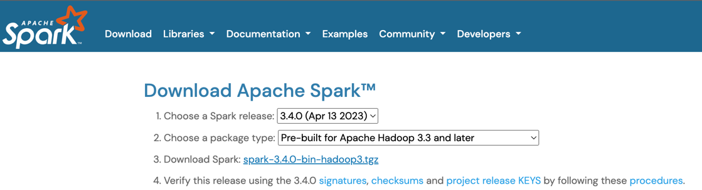
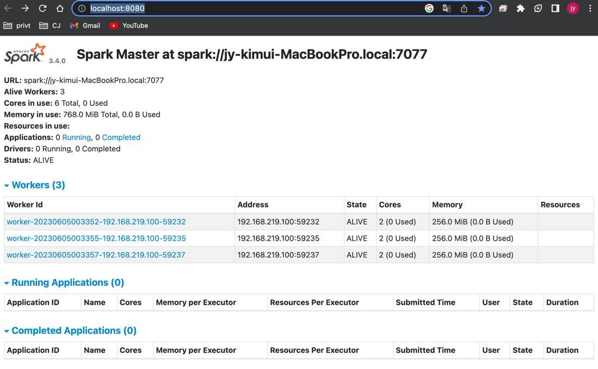
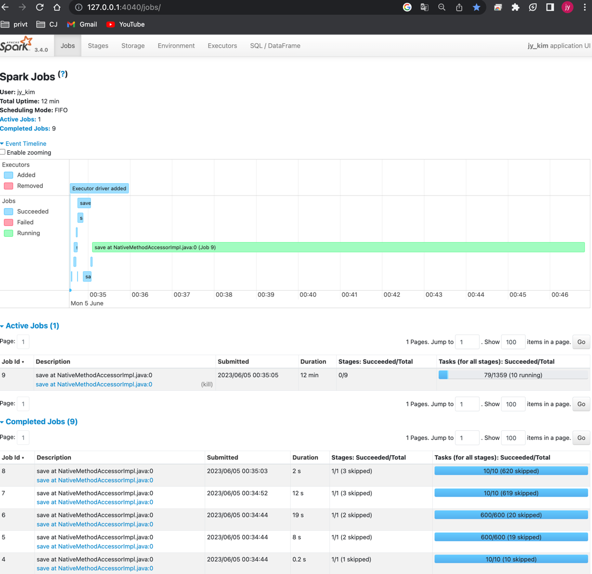

### Title: spark 설치
#### Env : macbook pro14 m2(silicon)
#### Date : 2023-02-04
#### Desc : Spark version 3.4.0, Python 3.9.16, Jdk(Zulu11.64)  

## spark
- 대규모 데이터 처리 통합 분산 엔진  
- 다양한 언어와 함께 사용가능
- 인메모리 아키텍처
- 오픈소스 프레임워크
- RDD(탄력적 뷴산형 데이터셋)
- 아키텍처
- 사용이유
<br/><br/>

###  <Spark Cluster 개념 (동작방식)>
- Step 1. 자원할당 : spark context -> cluster manager -> executor 할당  
- Step 2. Task 실행 : spark context -> 실행 파일, 설정을 executor 전달 -> task 실행  
<br/><br/>

### Spark Install Flow(Stand Alone) & Running  
1. https://spark.apache.org/downloads.html 에 Download Spark > 압축풀기  
  
2. 설치파일 경로 이동 : cd /Users/jy_kim/Downloads/spark-3.4.0-bin-hadoop3  
3. spark-env.sh 파일설정   
     - cd /Users/jy_kim/Downloads/spark-3.4.0-bin-hadoop3/conf  
     - vi spark-env.sh   
       ```  
        export PYSPARK_PYTHON=/usr/bin/python3.9
        export PYSPARK_DRIVER_PYTHON=/usr/bin/ipython
        export SPARK_WORKER_INSTANCES=3   # worker 개수    
        ```  
4. worker 실행  : cd /Users/jy_kim/Downloads/spark-3.4.0-bin-hadoop3/sbin  
     4-1. 마스터 실행 : ./start-master.sh 후 http://localhost:8080/ 접속     
     4-2. 메모리 & 코어수 지정 : ./start-slave.sh spark://jy-kimui-MacBookPro.local:7077  -m 256M -c 2  
        
5. pyspark shell 을 실행시키거나 python file 실행  
    
 
<br/><br/>
### 용어 정리/개념 설명
#### Shuffle
+ 발생 하는 경우 : 파티션에 데이터 재배치 될 때 발생, 맵리듀스에서 리듀스 단계 중 물리적 데이터 이동시
  + 디폴트 파티션 개수 : 200
  + 파일의 크기 : 128MB (128MB 클경우, 이 수치 만큼 쪼개서 읽음)
+ join, union, groupBy, sort, coalesce, repartition, aggregate 
+ reduce()에 해당하는 operation을 실행하기전에 물리적인 데이터의 이동이 있어야 하기 때문에 발생
+ 
#### <파티션의 개념 및 차이점>       
+ partition() : 코어수에 따라 할당, 1 Core = 1 Task = 1 Partition   
+ paritionby(column) : 디스크 데이터를 분산 할 때, 속도 향상 , write 함수      
+ repartition(partition count, column)  : 메모리에서 데이터 분산할 때  
+ coalesce: 디폴트는 파티션 수 감소할 때만 사용, numofpartition = true 시에는 파티는 증가도 가능  
           데이터 개수에 따라 다르지만, 분할보다 병합 비용이 더 큼

#### <coalesce() vs repartition()>
+ coalesce는 파티션을 줄일 때 사용하고, repartition()은 파티션 수를 늘리거나 줄일 때 사용(셔플의 유/무)
+ coalesce 는 파티션 별도 셜정필요, repartition은 파티션 디폴트 
+ 파티션 수를 줄일 땐 coalesce(), 파티션 수를 늘릴 땐 repartition()

#### Skew
+ 데이터 편향 현상, 고르게 파티션 별로 분배 되지 못할 떄 발생 
+ 해결 방법
  + (custom) repartition
  + sorting
  + bucketing
  + broadcast join
  + join tunning 
  
#### Spill
+ 역직렬화하여 연산 재개하는 행위
+ 발생사유 : 데이터 shuffle 시 자원 충분하지 못할 때 발생
+ 미치는 영향 
  + Task 지연, Error 발생 
  + Hadoop Cluster 사용률 높을 경우, 연달아 erro 발생하고 spark job 강제 종료 될 수 있음 
+ 방지방법
  + Skew 현상 제거
  + partition 수 감소
  + core 당 memory 양 증가 
+ shuffle spill
  + memory : spill 될 때 메모리에서 역직렬화된 데이터 크기
  + disk : spill 이후 디스크에서 직렬화될 때


#### <transformation vs action>  
  - transformation : query plan만 만들고 실제로 메모리에 올리지는 않음   
    ex) map, filter, distinct, union, reprtition, group by, intersection
  - action : 메모리 올려서 동작, Transformation을 실행, action의 return타입은 RDD에서 다른 타입   
    ex) collection, count, reduce, agg(regation)  

#### <spark vs mr>    
  - mr : data 처리 엔진, hdfs에 write 하는 오픈소스 프레임워크, 속도느림, 프로그램 속도느림, Java로 코드를 작성해야    
  - spark : 분석 프레임워크, mr 보다 빠름, 프로그램 용이, 프로그래밍 인터페이스를 갖추고 있으며 여러 언어를 지원  

#### <메모리 설정 팁>  
  - 전체 Executor 개수 설정
  - Executor 당 Core 개수 와 Memory 크기 설정
  - 셔플 읽기+쓰기 사이즈 < excutor 수  
  - (Spark Executor 수) X (Spark Core 수) < (서버 Node 개수) X (서버 Core 개수)   

#### <인메모리(memory, spark) vs 분산병렬(disk, hadoop)>       
  - 맵리듀스가 메모리에서 기반인가?, 디스크에서 기반인가? 의 차이   

#### < spark config 우선순위 >        
  - pyspark code > spark-submit > spark-defaults.conf 순서     
  - pyspark 코드 실행시 spark-submit 제출하면 UI에 spark-submit이 보일 수 있지만 실제는 코드 내 설정값으로 적용      

#### <Sql 보다, spark 엔진을 사용해야하는 이유>
  - Spark 은 다양한 엔진 및 라이브러리를 제공    
  - python, java, R 등 개발 언어와 함께 사용 할 수 있음    
  - Sql 단순 데이터베이스 조회에 적합-> sql 만 쓰면 그것만 하게 됨 spark 만큼 확장성 없어        


#### <Array Structure vs Array String>      
  - Array Structure : key, value 가 있는듯..     
  - Array String : 그냥 list 형태 인듯...
  - Array Type : 동일한 타입의 데이터로만 이루어짐   


- Executor : task 들이 수행, 디스크/메모리에 동작하는 곳
- In-Memory(인메모리) : 메모리 내에서 데이터 저장, 연산 병렬 처리 하는 것, 전력 소모 낮은편
- REPL : Read Eval Print Loop 
- master 인스턴스