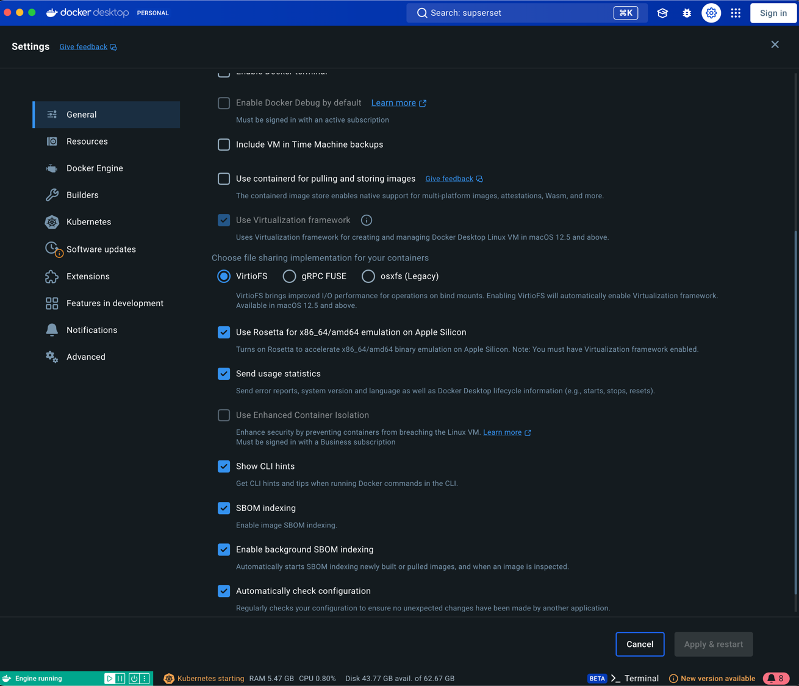
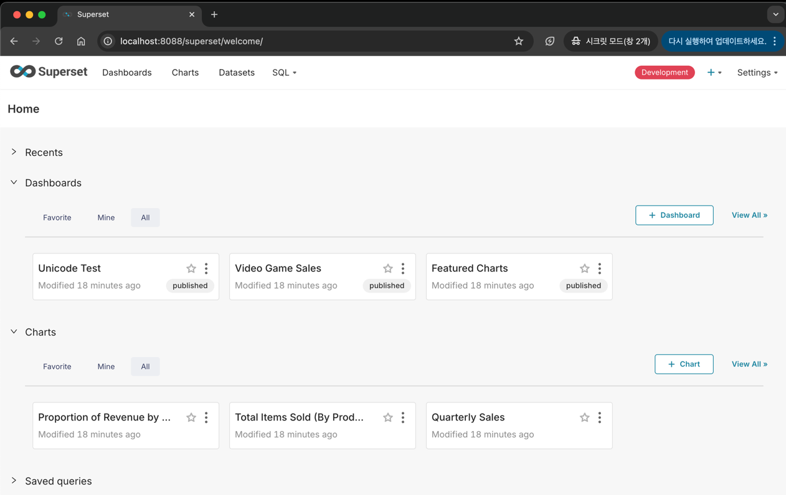

### Superset 설치
#### env : macbook pro14 m2(silicon), docker, superset 
#### date : 2024-10-17
  
#### reference :  
+  
## Superset
+  
<br/><br/>

## Superset Install Flow
1. [hive 4.0.1 설치 Link](https://dlcdn.apache.org/hive/hive-4.0.1/)        
    사전 hadoop 설치 반드시 필요, [Hadoop 설치 참조](./install_hadoop.md)   
    사전 mysql 설치 반드시 필요, [Hadoop 설치 참조](./install_mysql.md)      
    [JAVA8 설치 URL](https://www.azul.com/core-post-download/?endpoint=zulu&uuid=7b991cc1-0d5e-403f-a271-7cd622f1cb03)        
    [JAVA8 설치 방법](https://velog.io/@jiisuniui/%EC%8B%B8%ED%94%BCssafy%EC%9D%B8%EB%93%A4%EC%9D%84-%EC%9C%84%ED%95%9C-%EB%A7%A5%EB%B6%81mac-OS-M1-Monterey-Java8-Zulu-%EC%84%A4%EC%B9%98-%EB%B0%8F-%ED%99%98%EA%B2%BD%EB%B3%80%EC%88%98-%EC%84%A4%EC%A0%95)
2. ~/.bashrc hive 파일 경로 등록       
      ```export HIVE_HOME=/Users/jy_kim/Documents/apache-hive-3.1.3/bin```    
3. mysql 설정
   1. mysql root 계정 접속
         ```mysql -u root -p root```
   2. hive metastore database 생성 
    ```
        CREATE DATABASE metastore;
        USE metastore;
        create user 'hive@'%' identified by 'hive'; 
        grant all privileges on metastore.* to hive@'%' identified by 'hive';
        flush privileges;  
        exit;                    # root 계정 나온 뒤   
        mysql -u hive -p hive;   # hive 계정 로그인    
        create database hive;    # hive metastore DB 생성
    ``` 
4. [Superset 설치](https://velog.io/@syh0397/1.-%EC%8A%88%ED%8D%BC%EC%85%8B-%EC%84%A4%EC%B9%98%ED%95%98%EA%B8%B0-Mac-OS-m1%EC%B9%A9)           
   1. git clone : ``` git clone https://github.com/apache/superset.git ```      
   2. docker settings       
             
   3. master branch 에서 작업      
   ``` 
        cd superset 
        docker-compose -f docker-compose-non-dev.yml pull
        docker-compose -f docker-compose-non-dev.yml up
    ```       
   + supsert 로그인 정보       
      ```superset info  ID/PW : admin/admin```   
   
   

  

## Superset 응용  
+ Hive 연동
<br/>


## Solved Problem
+
<br/>


### 용어 정리
+ 
<br/>